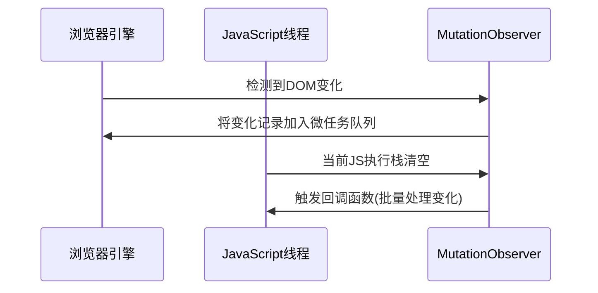

## JavaScript 核心知识整理

------

### 1️⃣ 数据类型

#### 基本数据类型

| 类型      | 描述                   | 内存位置                               |
| --------- | ---------------------- | -------------------------------------- |
| Number    | 数字，包括整数和浮点数 | 栈（小整数）、堆（大整数/浮点数）      |
| String    | 字符串                 | 堆，栈存引用，字符串相同时引用地址相同 |
| Boolean   | 布尔值                 | 栈                                     |
| Symbol    | 唯一标识符             | 栈                                     |
| null      | 空                     | 栈                                     |
| undefined | 未定义                 | 栈                                     |

#### 引用数据类型

| 类型     | 描述       |
| -------- | ---------- |
| Object   | 对象       |
| Array    | 数组       |
| Function | 函数       |
| Date     | 日期       |
| RegExp   | 正则表达式 |

#### 数据类型判断方法

| 方法                               | 优点                                     | 缺点                                        |
| ---------------------------------- | ---------------------------------------- | ------------------------------------------- |
| `typeof`                           | 快速区分基本类型                         | 对 `null` 返回 `object`，Array/对象无法区分 |
| `instanceof`                       | 区分 Array/Object/Function，自定义类实例 | 对基本类型不适用                            |
| `Object.prototype.toString.call()` | 精准判断各种类型                         | 写法较长                                    |

### 2️⃣ 栈 & 堆

| 属性     | 栈                 | 堆                           |
| -------- | ------------------ | ---------------------------- |
| 特性     | 先进后出（LIFO）   | 动态分配，先进先出（FIFO）   |
| 内存管理 | 自动分配释放       | 手动分配，程序结束由 OS 回收 |
| 用途     | 函数参数、局部变量 | 对象、引用类型               |
| 内存方向 | 高 → 低            | 低 → 高                      |

### 3️⃣ 闭包 (Closure)

#### 定义

> 闭包是指有权访问另一个函数作用域中变量的函数。

#### 条件

- 函数嵌套
- 内部函数引用外部函数局部变量

#### 优缺点

- **优点**：封装私有变量、实现模块化、延长局部变量生命周期
- **缺点**：可能导致内存泄漏

#### 场景

- 防抖、计数器、模块化设计

### 4️⃣ 原型 & 原型链


查找流程图

```
myDog 对象
    ↓ __proto__
Dog.prototype
    ↓ __proto__  
Animal.prototype
    ↓ __proto__
Object.prototype
    ↓ __proto__
    null
```

- 🎯 核心概念速览

  - 什么是原型？

     **原型（Prototype）** 是js中实现继承和属性共享的机制。每个js对象都有一个内部链接指向另一个对象，这个对象就是它的"原型"。

  - 什么是原型链？

​				**原型链（Prototype Chain）** 是js中对象属性查找的机制。当访问一个对象的属性时，如果对象本身没有这个属性，就会沿着原型链向上查找，直到找到属性或到达链的顶端（null）。

- #### 关系

  - 每个函数对象都有 `prototype`（显式原型）

  - 每个实例对象都有 `__proto__`（隐式原型）

  - `实例.__proto__` 指向 `构造函数.prototype`

    ```js
    Person.prototype.constructor = Person
    per._proto_ = Person.prototype
    
    Person.prototype._proto_=Object.prototype
    ```

    | 概念          | 说明                             | 指向关系                                  |
    | ------------- | -------------------------------- | ----------------------------------------- |
    | `__proto__`   | 实例对象的内部属性，指向其原型   | `person.__proto__` → `Person.prototype`   |
    | `prototype`   | 函数的属性，包含共享的属性和方法 | `Person.prototype` → 原型对象             |
    | `constructor` | 原型对象的属性，指向构造函数     | `Person.prototype.constructor` → `Person` |

- #### 作用

    - 实现继承
    - 所有实例共享原型方法和属性

    #### 原型链的查找过程是什么？

    1. 在对象自身查找属性
    2. 如果没找到，查找`obj.__proto__`（即构造函数的prototype）
    3. 继续沿着原型链向上查找
    4. 直到找到属性或到达`Object.prototype.__proto__`（null）
    5. 如果整条链都没找到，返回undefined


### 5️⃣ 继承方式

#### 原型链继承

```js
Child.prototype = new Parent();
```

#### 构造函数继承

```js
function Child() {
  Parent.call(this);
}
```

#### 组合继承

```js
function Child(arg1, arg2) {
  Parent.call(this, arg1);
  this.arg2 = arg2;
}
Child.prototype = new Parent();
Child.prototype.constructor = Child;
```

#### 完整继承（兼容 ES5/ES6）

```js
function inherit(Child, Parent) {
  Child.prototype = Object.create(Parent.prototype);
  Child.prototype.constructor = Child;
  Child.super = Parent;
  if (Object.setPrototypeOf) {
    Object.setPrototypeOf(Child, Parent);
  } else if (Child.__proto__) {
    Child.__proto__ = Parent;
  } else {
    for (let k in Parent) {
      if (Parent.hasOwnProperty(k) && !(k in Child)) Child[k] = Parent[k];
    }
  }
}
```

### 6️⃣ call / apply / bind

```js
fn.call(obj, arg1, arg2);    // 立即调用
fn.apply(obj, [arg1, arg2]); // 立即调用，参数数组
let b = fn.bind(obj);        // 返回新函数，可延迟调用
```

```js
class Person {
  constructor(name, age) {
    this.name = name
    this.age = age
  }
  sayHello() { // 普通函数绑定在构造函数原型(\_proto\_)上
    console.log(this.name)
  }
  myAge = () => { // 箭头函数在构造函数上
    console.log(this.age)
  }
}
const p = new Person('hello', 18)
p.sayHello() // hello
p.myAge() // 18
console.log(p.hasOwnProperty('sayHello')) // false
console.log(p.__proto__.hasOwnProperty('sayHello')) // true
console.log(p.hasOwnProperty('myAge')) // true
console.log(p.__proto__.hasOwnProperty('myAge')) // false
```
### 7️⃣ ES6 新特性

#### class

- 方法不可枚举
- 必须用 `new` 调用
- 不存在变量提升
- 默认严格模式
- 子类必须在 constructor 中调用 `super()`

#### 箭头函数

- 没有 `this`，继承外部作用域
- 不能作为构造函数

#### Map vs Object

|          | Map          | Object          |
| -------- | ------------ | --------------- |
| key 类型 | 任意         | string / symbol |
| 顺序     | 保持插入顺序 | 不保证          |

#### Promise

- 状态：`pending` → `fulfilled` / `rejected`
- 特性：状态不可变
- then 返回新 Promise

```
.then` 第二个参数 vs `.catch
```

| 特性     | then 第二个参数  | catch                    |
| -------- | ---------------- | ------------------------ |
| 捕获范围 | 仅前一个 promise | 链中所有未处理 rejection |
| 链式行为 | 返回 resolved    | 返回 resolved            |
| 错误穿透 | 不穿透           | 穿透                     |
| 最佳场景 | 局部错误处理     | 全局错误处理             |

#### async / await

- 基于 Generator + Promise
- 遇到 `await` 暂停函数，等待 Promise 完成
- V8 优化：零成本 await

- ```js
  // 生成器版本
  function* fetchGenerator() {
    const data = yield fetch('/data');
    const processed = yield process(data);
    return processed;
  }
  
  // async/await 版本
  async function fetchAsync() {
    const data = await fetch('/data');
    const processed = await process(data);
    return processed;
  }
  ```

#### generator

- 可迭代对象，手动控制执行流程

### 8️⃣ this 指向

| 调用方式        | this 指向                      |
| --------------- | ------------------------------ |
| 普通函数        | window / undefined（严格模式） |
| 对象方法        | 调用对象                       |
| 构造函数        | 实例对象                       |
| 箭头函数        | 定义时的 this（词法作用域）    |
| call/apply/bind | 强制指定                       |

### 节流 & 防抖
- 节流
	在一定时间内执行一次，函数会先立即执行一次，之后保证在一定时间间隔内只执行一次
	
	```js
	function throttle(fn, delay) {
	  let lastTime = 0
	  return function () {
	    let nowTime = Date.now()
	    if (nowTime - lastTime > delay) {
	      setTimeout(() => {
	        fn.apply(this)
	        lastTime = nowTime
	      }, delay);
	    }
	  }
	}
	```
	
	```js
	/**
	 * 优化后的节流函数
	 * @param {Function} fn 需要节流的函数
	 * @param {number} delay 节流时间（毫秒）
	 * @param {boolean} [trailing=true] 是否在节流结束后执行最后一次调用
	 * @returns {Function} 节流处理后的函数
	 */
	function throttle(fn, delay, trailing = true) {
	  let lastExecTime = 0;
	  let timer = null;
	  let pending = false;
	  
	  return function(...args) {
	    const now = Date.now();
	    const context = this;
	    
	    // 立即执行条件：距离上次执行超过延迟时间
	    if (now - lastExecTime >= delay) {
	      // 清除等待中的执行
	      if (timer) {
	        clearTimeout(timer);
	        timer = null;
	      }
	      
	      // 执行函数并更新最后执行时间
	      fn.apply(context, args);
	      lastExecTime = now;
	      pending = false;
	    } 
	    // 处理尾部执行
	    else if (trailing && !pending) {
	      pending = true;
	      
	      // 计算剩余等待时间
	      const remaining = delay - (now - lastExecTime);
	      
	      timer = setTimeout(() => {
	        fn.apply(context, args);
	        lastExecTime = Date.now();
	        timer = null;
	        pending = false;
	      }, remaining);
	    }
	  };
	}
	```
	
	
	
- 防抖
	多次触发函数只会在最后一次执行
	
	```js
	function debounce(fn, delay) {
	  let timer = null
	  return function () {
	    clearTimeout(timer)
	    timer = setTimeout(() => {
	      fn.apply(this)
	    }, delay)
	  }
	}
	```
	
	```js
	/**
	 * 优化的防抖函数
	 * @param {Function} func 需要防抖的函数
	 * @param {number} [wait=500] 防抖等待时间（毫秒）
	 * @param {boolean} [immediate=false] 是否立即执行
	 * @returns {Function} 防抖处理后的函数
	 */
	function debounce(func, wait = 500, immediate = false) {
	  let timeout = null;
	  
	  const debounced = function(...args) {
	    const context = this;
	    const later = function() {
	      timeout = null;
	      if (!immediate) {
	        func.apply(context, args);
	      }
	    };
	    
	    const callNow = immediate && !timeout;
	    
	    // 清除现有定时器
	    if (timeout) {
	      clearTimeout(timeout);
	    }
	    
	    // 设置新定时器
	    timeout = setTimeout(later, wait);
	    
	    // 立即执行
	    if (callNow) {
	      func.apply(context, args);
	    }
	  };
	  
	  // 添加取消方法
	  debounced.cancel = function() {
	    if (timeout) {
	      clearTimeout(timeout);
	      timeout = null;
	    }
	  };
	  
	  return debounced;
	}
	```
	
	```typescript
	
	const debounce = (func:ReturnType<typeof Function>, wait?: number, immediate?: boolean) => {
	  wait = wait || 500
	  let timeout
	  return function() {
	    const ctx = this
	    const args = arguments
	    const callNow = immediate && !timeout
	    timeout && clearTimeout(timeout)
	    timeout = setTimeout(() => {
	      timeout = null
	      if(!immediate) {
	        func.apply(ctx, args)
	      }
	    }, wait)
	
	    if (callNow) {
	      func.apply(ctx, args)
	    }
	  }
	}
	```
	
- 节流与防抖对比
	
	| **特性**     | **节流(throttle)**       | **防抖(debounce)**     |
	| :----------- | :----------------------- | :--------------------- |
	| **目标**     | 限制执行频率             | 限制执行次数           |
	| **执行时机** | 固定间隔执行             | 停止触发后执行         |
	| **适用场景** | 滚动、调整大小、鼠标移动 | 搜索输入、窗口调整结束 |
	| **立即执行** | 总是立即首次执行         | 可配置是否立即执行     |
	| **尾部执行** | 可配置是否尾部执行       | 总是尾部执行           |
	| **执行次数** | 保证固定频率执行         | 只执行最后一次         |
	| **内存占用** | 较低                     | 较高（需维护定时器）   |
	
- ```mermaid
  sequenceDiagram
      participant 用户操作
      participant 节流函数
      participant 防抖函数
      
      用户操作->>节流函数: 触发事件
      节流函数->>节流函数: 立即执行（首次）
      
      用户操作->>节流函数: 快速连续触发
      节流函数->>节流函数: 忽略中间触发
      
      用户操作->>节流函数: 停止触发
      节流函数->>节流函数: 尾部执行（可选）
      
      用户操作->>防抖函数: 触发事件
      防抖函数->>防抖函数: 立即执行（可选）
      
      用户操作->>防抖函数: 快速连续触发
      防抖函数->>防抖函数: 重置定时器
      
      用户操作->>防抖函数: 停止触发
      防抖函数->>防抖函数: 等待延迟后执行
  ```

- 场景
	节流：滚动加载更多，高频点击，表单重复提交
	防抖：搜索框输入

### 10️⃣ 事件代理

- 原理：事件冒泡 + 委托
- 优点：
  - 减少 DOM 注册，提高性能
  - 动态子元素自动绑定事件


### 11️⃣ new 一个对象的全过程

1. 创建空对象 `obj`
2. `obj.__proto__ = 构造函数.prototype`
3. 构造函数内部 `this 指向 obj` 
4. 返回对象：
   - 返回非对象：返回 `obj`
   - 返回对象：返回该对象

### 自定义new
```js
function newFun(...args) {
  // 取出args的第一个参数，即目标的构造函数
  const constructor = args.shift() // [Function: Person]（Person为目标函数名称）
  // 创建一个空对象obj，且继承构造函数的prototype属性
  const obj = Object.create(constructor.prototype) // obj.__proto__ === constructor.prototype
  // 将构造函数内部this指向obj，并执行构造函数，返回结果
  const result = constructor.apply(obj, args)
	// 判断返回结果，如果为对象类型，则返回result；否则返回obj
  return (typeof result === 'object' && result !== null) ? result : obj
}
```
### 深拷贝 & 浅拷贝
- 浅拷贝
	复制一层对象的属性，并不包括对象里引用类型的数据；当改变拷贝对象的引用类型时，源对象也会改变；
- 深拷贝
	重新开辟一个空间，需要递归拷贝对象里的引用；直到子属性都为基本类型；
	两个对象对应两个不同的地址，互不影响；
	- 实现
        - JSON.parse() JSON.stringify()
            缺点： 
            - 拷贝之后，对象的构造函数都会变成Object
            - RegExp无法实现拷贝
            - function直接消失
            - 自定义
```js
function deepCopy(obj) {
  let result = Array.isArray(obj) ? [] : {};
  for (let key in obj) {
    if (obj.hasOwnProperty(key)) {
      if (typeof obj[key] === 'object' && obj[key]!==null) {
        result[key] = deepCopy(obj[key]);   //递归复制
      } else {
        result[key] = obj[key];
      }
    }
  }
  return result;
}
```
```js
a = window.structuredClone(b);
```

```js
const _ = require("lodash");
const clone = _.cloneDeep(yourObject);
```

### 数组转tree结构

```js
/**
 * 利用对象浅拷贝 非递归实现，时间复杂度O(n)
 * @param {原数组} arr
 * @param {根节点id} rootId
 * @param {id} id
 * @param {pid} pid
 */
function jsonArray2Tree(arr, rootId, id, pid) {
  // 浅复制出一份数据并加上 children 字段
  let obj = {}
  arr.forEach(v => {
    obj[v[id]] = v
    obj[v[id]].children = []
  })
  let tree = []
  arr.forEach(v => {
    if (v[pid] == rootId) {
      tree.push(v)
    }
    // 拿此刻循环值的 pid 去复制数据里面找到对应父级然后塞到它的 children 中
    obj[v[pid]] && obj[v[pid]].children.push(v)
  })
  return tree
}
```
### 内存泄漏

常见原因：

1. **闭包**：闭包引用外部变量，导致变量无法释放。
2. **循环引用**：对象之间互相引用，GC无法回收。
3. **DOM事件未解绑**：尤其在 SPA 页面频繁创建销毁元素。
4. **全局变量**：长期占用全局对象，无法释放。

### 垃圾回收
- 标记清除
	当变量进入执行环境时，被标记为‘进入环境’；
	当变量离开执行环境时，会被标记为‘离开环境’；
	垃圾回收器会销毁那些带标记的值，并回收他们占用的内存空间
- 谷歌浏览器：
	“查找引用”，浏览器不定时去查找当前内存的引用，如果没有被占用了，浏览器会回收它；如果被占用，就不能回收。
- IE浏览器
	“引用计数法”，当前内存被占用一次，计数累加1次，移除占用就减1，减到0时，浏览器就回收它。
### `==` vs `===`

| 特性         | `==`                          | `===`                |
| ------------ | ----------------------------- | -------------------- |
| 类型转换     | 会进行类型转换                | 不进行类型转换       |
| 引用类型比较 | 比较地址                      | 比较地址             |
| 特殊情况     | `null == undefined` 为 `true` | 需要类型和值完全相等 |
| 推荐使用     | 少用，避免隐式转换            | 推荐使用             |

### `<script>` 属性：async & defer

| 属性  | 解析顺序       | 执行顺序               | 是否阻塞 DOM         |
| ----- | -------------- | ---------------------- | -------------------- |
| 普通  | HTML解析时暂停 | 下载完立即执行         | 是                   |
| async | HTML解析继续   | 下载完立即执行         | 否，但执行会暂停解析 |
| defer | HTML解析继续   | HTML解析完成后顺序执行 | 否                   |

- 普通
	浏览器在解析HTML时，若遇到一个没有任何属性的script标签，就会暂停解析；
	先发送网络请求，获取该js脚本内容，然后让js引擎执行该代码；
	代码执行完毕后恢复解析；
	
- async
	请求该脚本的网络请求是异步的，不会阻塞浏览器解析HTML代码；
	一旦网络请求回来，若HTML还没解析完，浏览器会暂停解析；
	先让js引擎执行代码；
	执行完毕后再进行解析；
	
- defer
	获取该脚本的网络请求也是异步的，不会阻塞浏览器介解析HTML；
	一旦网络请求回来，若此时HTML还没解析完；
	浏览器等待HTML解析完，在执行js代码；
	

### MutationObserver

#### 作用

用于异步监听DOM树的变化



#### 使用方式

- 创建观察者模式

  ```js
  // 创建回调函数
  // (所有被触发改动的 MutationRecord 对象数组, 调用该函数的 MutationObserver 对象)
  const callback = (mutationsList, observer) => {
      for(const mutation of mutationsList) {
          if (mutation.type === 'childList') {
              console.log('子节点变化:', mutation.addedNodes, mutation.removedNodes);
          }
          else if (mutation.type === 'attributes') {
              console.log(`属性 ${mutation.attributeName} 变化:`, 
                           mutation.oldValue, 
                           mutation.target.getAttribute(mutation.attributeName));
          }
      }
  };
  
  // 创建观察者实例
  const observer = new MutationObserver(callback);
  ```

- 配置观察选项

  ```js
  const config = {
      subtree: true,         // 监视所有后代节点
      childList: true,       // 监视子节点变化
      attributes: true,      // 监视属性变化
      attributeOldValue: true, // 记录旧属性值
      attributeFilter: ['class', 'data-id'], // 只监视特定属性
      characterData: false,  // 不监视文本节点变化
      characterDataOldValue: false
  };
  ```

- 启动和停止观察

  ```js
  // 开始观察目标节点
  const targetNode = document.getElementById('app');
  observer.observe(targetNode, config);
  
  // 停止观察
  observer.disconnect();
  
  // 获取未处理的变更
  const mutations = observer.takeRecords();
  ```

  ```js
  // 动态修改 DOM 测试
  const newDiv = document.createElement('div');
  newDiv.textContent = 'Hello MutationObserver';
  targetNode.appendChild(newDiv); // 会触发 childList 回调
  
  targetNode.setAttribute('data-test', '123'); // 会触发 attributes 回调
  
  newDiv.textContent = 'Text updated'; // 会触发 characterData 回调
  ```

  

- 批量变化处理

  ```js
  const observer = new MutationObserver((mutations) => {
      // 使用requestAnimationFrame减少重绘
      requestAnimationFrame(() => {
          console.log(`批量处理 ${mutations.length} 个变更`);
          // 实际处理逻辑...
      });
  });
  ```


### requestIdleCallback & requestAnimationFrame & setTimeout

- #### setTimeout

  - 定义
    - 在指定延迟后执行回调函数，属于宏任务
    
  - 特点
    - 无法保证精确执行时间（可能因主线程阻塞而延迟）
    
      JS 只有一个线程执行同步代码，如果定时器到期时线程正忙，回调只能等到当前执行栈清空后再执行
    
      `setTimeout(fn, 0)`，浏览器规定 **最小延迟 4ms**
    
    - 适合非视觉相关的延迟任务
    
  - 缺点
    - 频繁使用可能导致性能问题（如：动画卡顿）
    - 与屏幕刷新率不同步，易导致动画丢失

- #### requestAnimationFrame

  - 定义

    - 在浏览器下一次重绘前执行回调函数，专门为高性能动画设计

  - 特点

    - 与屏幕刷新率同步（通常60HZ，即每16.7ms执行一次）
    - 自动暂停在后台标签页，节省资源
    - 提供精确的时间戳参数（DOMHighResTimeStamp），用于计算帧率

  - 应用场景

    - 动画（CSS、canvas）
    - 高频视觉更新
    - 布局测量（避免强制同步布局）

  - 示例

    - 一次性渲染十万条数据
      - 每次电脑屏幕 16.7ms 后刷新一下，定时器就会产生 20 个`li`，`dom`结构的出现和屏幕的刷新保持了一致
      - `fragment`是虚拟文档碎片，我们一次`for`循环产生 20 个`li`的过程中可以全部把真实`dom`挂载到`fragment`上，然后再把`fragment`挂载到真实`dom`上，这样原来需要回流十万次，现在只需要回流`100000 / 20`次

    [100000列表渲染 - 码上掘金](https://code.juejin.cn/pen/7538081449229058058)

    ```js
    <script>
        const total = 100000
        let ul = document.getElementById('container')
        let once = 20
        let page = total / once
        function loop(curTotal) {
            if (curTotal <= 0) return 
            let pageCount = Math.min(curTotal, once) 
            window.requestAnimationFrame(() => {
                let fragment = document.createDocumentFragment() // 创建一个虚拟文档碎片
                for (let i = 0; i < pageCount; i++) {
                    let li = document.createElement('li')
                    li.innerHTML = ~~(Math.random() * total)
                    fragment.appendChild(li) // 挂到fragment上
                }
                ul.appendChild(fragment) // 现在才回流
                loop(curTotal - pageCount)
            })
        }
        loop(total)
    </script>
    ```

    

- #### requestIdleCallback

  - 定义
    - 在浏览器空闲时期执行低优先级任务，避免阻塞关键渲染
  - 特点
    - 接收IdleDealine参数：包含
      - timeRemaining()：当前帧剩余空闲时间（通常<=50ms）
      - didTimeout：任务是否因超时被强制执行
    - 可配置超时时间（{timeout： N}），超时后强制执行
  - 应用场景
    - 非关键任务（如埋点，数据预加载）
    - 耗时计算（拆分多个空闲任务执行）
    - 后台数据同步（如保存草稿）

  - 示例

    ```js
    requestIdleCallback((deadline) => {
      while (deadline.timeRemaining() > 0) {
        doLowPriorityTask(); // 拆分任务
      }
    }, { timeout: 2000 }); // 2秒超时
    ```

- #### 区别

  | **特性**           | `setTimeout`   | `requestAnimationFrame` (rAF) | `requestIdleCallback` (rIC) |
  | :----------------- | :------------- | :---------------------------- | :-------------------------- |
  | **触发时机**       | 指定延迟后     | 下一帧渲染前                  | 浏览器空闲时                |
  | **执行频率**       | 自定义         | 同步屏幕刷新率（≈60fps）      | 取决于空闲时间              |
  | **是否阻塞渲染**   | 可能阻塞       | 不阻塞（在渲染前执行）        | 完全不阻塞                  |
  | **适用任务优先级** | 中/低          | **高**（视觉更新）            | **低**（后台任务）          |
  | **资源消耗**       | 可能浪费资源   | 高效（后台自动暂停）          | 高效（仅空闲时运行）        |
  | **精确时间控制**   | ❌ 延迟不精确   | ✅ 提供高精度时间戳            | ✅ 提供剩余空闲时间          |
  | **典型场景**       | 延迟逻辑、轮询 | 动画、布局测量                | 日志上报、预加载            |

- #### 示例

  计算从0到2000000000的累加
  
  start = 0; end = 2000000000;

  - Web Worker

    ```js
    function runWithWorker() {
        const w1 = new Worker('./index-worker.js');
        w1.postMessage({ start, end });
        w1.onmessage = (event) => {
            console.log('main', event)
        }
    }
    // index-worker.js
    self.onmessage = function(event) {
      console.log('web worker',event)
      const { start, end } = event.data;
      let sum = 0;
      for(let i=start;i<=end;i++) {
        sum += i;
      }
      self.postMessage('sum', sum)
    }
    ```

    

  - requestAnimationFrame

    ```js
    function runWithRAF() {
      // 初始化变量
      let current = start; // 当前处理的位置
      let sum = 0; // 累加结果
      const chunkSize = 10000000; // 每块处理1千万个数字
      function doChunk() {
        // 记录帧开始时间
        const frameStart = performance.now();
        // 计算当前块的结束位置
        const chunkEnd = Math.min(current + chunkSize, end);
        // 处理当前块
        while (current <= chunkEnd) {
          sum += current++; // 累加数字并移动指针
        }
        // 更新进度
        const progress = (current / end) * 100;
        updateProgress(progress, current);
        // 检查是否完成
        if (current > end) {
          showResult(sum);
          return;
        }
        // 智能调度下一块
        const elapsed = performance.now() - frameStart;
        if (elapsed < 10) {
          doChunk(); // 当前帧还有时间，立即执行下一块
        } else {
          requestAnimationFrame(doChunk); // 等待下一帧
        }
      }
      // 启动第一块
      requestAnimationFrame(doChunk);
    }
    ```

    - 为什么if (elapsed < 10)

      1. 帧时间预算分配

      | 时间段         | 分配时间 | 用途                       |
      | :------------- | :------- | :------------------------- |
      | JavaScript执行 | ≤10ms    | 执行应用逻辑、计算任务     |
      | 浏览器渲染工作 | ≥6.67ms  | 样式计算、布局、绘制、合成 |
      | **总帧时间**   | 16.67ms  | 实现60FPS的流畅体验        |

    `if (elapsed < 10)` 这个条件判断是确保页面流畅性的关键优化策略：

    1. **安全边界**：为浏览器渲染保留最少6ms时间
    2. **性能平衡**：在充分利用帧时间和保证流畅性之间取得平衡
    3. **预防卡顿**：避免JavaScript独占帧时间导致丢帧
    4. **响应保障**：确保用户交互能得到及时响应

    这个10ms阈值是Web性能优化的最佳实践之一，它源自多年积累的经验和对浏览器渲染管线的深入理解

  - requestIdleCallback

    ```js
    function runWithRIC () {
        let sum = 0;
        let current = 0;
        const chunkSize = 1000000; // 每块处理1百万次计算
        function doChunk (deadline) {
            while (current <= end && deadline.timeRemaining() > 0) {
                const chunkEnd = Math.min(current + chunkSize, end);
                for (let i = current; i <= chunkEnd; i++) {
                    sum += i;
                }
                current = chunkEnd + 1;
                // 更新进度
                const progress = (current / end) * 100;
                console.log(progress);
                if (current > end) {
                    console.log('计算完成', sum);
                    return;
                }
            }
            requestIdleCallback(doChunk);
        }
        requestIdleCallback(doChunk);
    }
    ```

    