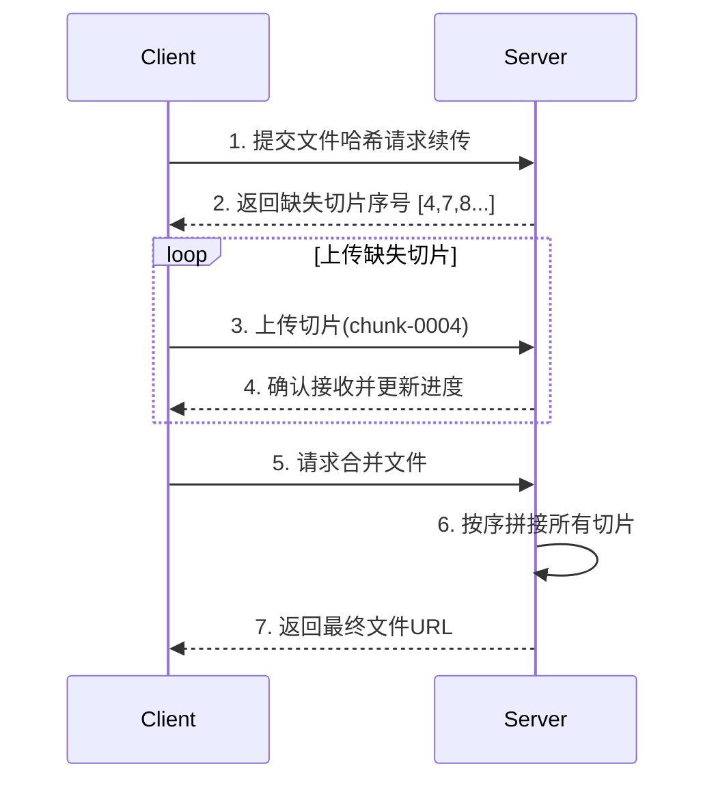

## 目录

- [一、优化目标与度量](https://chatgpt.com/c/68a50f5a-0684-8325-abe4-f1776b3ad938#一优化目标与度量)
- [二、构建与工程优化](https://chatgpt.com/c/68a50f5a-0684-8325-abe4-f1776b3ad938#二构建与工程优化)
- [三、网络与传输优化](https://chatgpt.com/c/68a50f5a-0684-8325-abe4-f1776b3ad938#三网络与传输优化)
- [四、图片与多媒体优化（WebP/AVIF）](https://chatgpt.com/c/68a50f5a-0684-8325-abe4-f1776b3ad938#四图片与多媒体优化webpavif)
- [五、渲染与交互优化](https://chatgpt.com/c/68a50f5a-0684-8325-abe4-f1776b3ad938#五渲染与交互优化)
- [六、运行时与计算优化](https://chatgpt.com/c/68a50f5a-0684-8325-abe4-f1776b3ad938#六运行时与计算优化)
- [七、大文件上传与可靠传输](https://chatgpt.com/c/68a50f5a-0684-8325-abe4-f1776b3ad938#七大文件上传与可靠传输)
- [八、缓存策略与离线](https://chatgpt.com/c/68a50f5a-0684-8325-abe4-f1776b3ad938#八缓存策略与离线)
- [九、常用代码片段](https://chatgpt.com/c/68a50f5a-0684-8325-abe4-f1776b3ad938#九常用代码片段)
- [十、框架与项目实践](https://chatgpt.com/c/68a50f5a-0684-8325-abe4-f1776b3ad938#十框架与项目实践)
- [十一、速查表（合并版）](https://chatgpt.com/c/68a50f5a-0684-8325-abe4-f1776b3ad938#十一速查表合并版)
- [十二、附录：服务端与构建配置示例](https://chatgpt.com/c/68a50f5a-0684-8325-abe4-f1776b3ad938#十二附录服务端与构建配置示例)

------

## 一、优化目标与度量

- **核心 Web Vitals**：LCP（最大内容绘制）、FID（首次输入延迟/INP）、CLS（累计位移）。
- **监控建议**：Lighthouse、Performance 面板、Sentry/阿里 ARMS、Web Vitals SDK。

> 实施顺序建议：**图片优化 → 缓存与代码拆分 → 动画/交互 → 监控与持续优化**。

------

## 二、构建与工程优化

### 1. 移除控制台打印

- **Webpack 插件**

```js
new TerserPlugin({
  terserOptions: { compress: { drop_console: true } }
})
```

- **Babel 插件**：`babel-plugin-transform-remove-console`

### 2. 按需引入

- 组件库：
  - AntD → `babel-plugin-import`
  - ElementUI → `babel-plugin-component`
- lodash：

```js
import debounce from 'lodash/debounce'
```

### 3. 代码瘦身与兼容

- 小图片转 base64：

```js
{
  test: /\.(png|jpg|gif)$/,
  loader: 'url-loader',
  options: { limit: 8192 } // 小于8kb转base64
}
```

- 取消 sourceMap（生产）：

```js
// vue.config.js / webpack 配置
configureWebpack: { devtool: false }
```

- 减少 ES6→ES5 冗余：

```json
// .babelrc
{
  "plugins": ["@babel/plugin-transform-runtime"]
}
```

### 4. 代码分割 & 路由懒加载

- **Vue Router**：

```js
const Home = () => import('@/views/Home.vue')
```

- **动态 import**：分包、首屏更轻。

### 5. 预加载 / 预取（工程层）

```html
<link rel="preload" as="script" href="/app.chunk.js">
<link rel="prefetch" href="/settings.chunk.js">
```

### 6. 全局组件自动加载（Vue）

```ts
import { createApp } from 'vue'
export function registerGlobalComponent(app: ReturnType<typeof createApp>): void {
  const files = (require as any).context('./global', true, /\.(vue|ts)$/)
  files.keys().forEach((key) => {
    const compName = key.replace(/^\.\//, '').replace(/\.(vue|ts)$/, '')
    const config = files(key).default || files(key)
    app.component(compName, config)
  })
}
```

> Vite 可用 `import.meta.glob` 实现等效能力。

------

## 三、网络与传输优化

### 1. 缓存策略

- **HTTP 缓存**：`Cache-Control / Expires / ETag / Last-Modified`
- **浏览器缓存**：`localStorage / sessionStorage / IndexedDB`
- **Service Worker**：PWA 离线缓存（见后文）

### 2. CDN 加速

- 静态资源（JS/CSS/图片）上 CDN，资源文件名带 **hash**（版本更新即失效）。
- **DNS 负载均衡**：自动选择就近节点。
- **缓存更新策略**：
  - 主动刷新（API 调用刷新节点缓存）
  - 被动拉取（过期自动回源）

### 3. 压缩传输

- **Webpack**：

```js
new CompressionWebpackPlugin({ algorithm: 'gzip' })
```

- **请求头**：

```http
Accept-Encoding: gzip
```

- **Nginx**：见附录。

### 4. 大文件上传（分片/断点/秒传/并发）

> 详见第七章，包含标识设计、进度存储、接口及合并策略。

------

## 四、图片与多媒体优化（WebP/AVIF）

### 1. 懒加载

- 原生：

```html

```

- Intersection Observer：

```js
const ob = new IntersectionObserver((entries) => {
  for (const entry of entries) {
    if (entry.isIntersecting) {
      const img = entry.target
      img.src = img.dataset.src
      ob.unobserve(img)
    }
  }
}, { root: null, rootMargin: '0px', threshold: 0 })

document.querySelectorAll('img[data-src]').forEach((img) => ob.observe(img))
```

### 2. 使用 CSS 代替图片

- `box-shadow / linear-gradient / border-radius` 等可替代装饰性图片。

### 3. 上传前压缩（Canvas）

```js
const canvas = document.createElement('canvas')
const ctx = canvas.getContext('2d')
ctx.drawImage(img, 0, 0, w, h)
canvas.toBlob((blob) => { /* 上传 blob */ }, 'image/jpeg', 0.7)
```

> 参考你的本地笔记：`D:\\Data\\前端学习笔记\\前端面试知识点总结\\canvas图片压缩.md`

### 4. WebP 方案

**核心优势**

| 指标       | WebP vs JPEG/PNG                         | 说明                |
| ---------- | ---------------------------------------- | ------------------- |
| 体积压缩率 | 比 JPEG 小 **25-35%**、比 PNG 小 **26%** | 同画质显著减少带宽  |
| 支持特性   | 有损/无损、透明度 Alpha、动画            | 可替代 JPEG/PNG/GIF |
| 解码速度   | 比 JPEG 慢 1.5~2.2 倍，较 PNG 快         | 需权衡 CPU          |

**命令行转换**（cwebp）

```bash
# 单文件（默认 75% 质量）
cwebp input.jpg -o output.webp
# 批量转换
find ./images -name "*.jpg" -exec cwebp {} -o {}.webp \;
```

- 常用参数：`-q 80`（质量 75-85 平衡）、`-m 6`（压缩级别）、`-lossless`（无损）。

**Node.js 集成**（imagemin-webp）

```js
const imagemin = require('imagemin')
const imageminWebp = require('imagemin-webp')
;(async () => {
  await imagemin(['images/*.{jpg,png}'], {
    destination: 'webp_images',
    plugins: [imageminWebp({ quality: 75 })]
  })
})()
```

**GUI**：Squoosh（预览对比、进阶参数）。

**前端部署**：

```html
<picture>
  <source srcset="image.webp" type="image/webp">
  
</picture>
```

**CDN 动态适配**：Cloudflare Polish / Akamai Image Manager（自动转换与缓存）。

**兼容性嗅探**

```js
const supportWebP = () => new Promise(resolve => {
  const image = new Image()
  image.onerror = () => resolve(false)
  image.onload = () => resolve(image.width === 1)
  image.src = 'data:image/webp;base64,UklGRiQAAABXRUJQVlA4IBgAAAAwAQCdASoBAAEAAwA0JaQAA3AA/vuUAAA='
}).catch(() => false)
```

### 5. AVIF 方案

**核心优势（对比 WebP/JPEG）**

| 指标     | AVIF 表现                                                    | 对标差距           |
| -------- | ------------------------------------------------------------ | ------------------ |
| 压缩效率 | 比 JPEG 小 **50%+**，比 WebP 小 **20-30%**                   | 同等画质下压缩最佳 |
| 功能支持 | HDR（10/12bit）、广色域（BT.2020）、有/无损、渐进式、深度图/图层 | 高阶能力           |
| 画质保留 | 低码率细节更好，纹理/渐变优势明显                            | 主观评分更高       |

**工具链**

- libavif：

```bash
# 构建
git clone https://github.com/AOMediaCodec/libavif.git
cd libavif && mkdir build && cd build
cmake .. && make
# 转换
avifenc -c aom -s 6 -q 35 input.jpg output.avif
```

- FFmpeg（单帧 AVIF）：

```bash
ffmpeg -i frame.png -c:v libaom-av1 -still-picture 1 frame.avif
```

- Node.js（Sharp）：

```js
const sharp = require('sharp')
sharp('input.png')
  .avif({ quality: 45, effort: 6, chromaSubsampling: '4:4:4' })
  .toFile('output.avif')
```

- Vite 插件：

```js
// vite.config.js
import { defineConfig } from 'vite'
import avif from 'vite-plugin-avif'
export default defineConfig({ plugins: [avif({ quality: 50 })] })
```

**部署策略**

```html
<picture>
  <source srcset="image.avif" type="image/avif">
  <source srcset="image.webp" type="image/webp">
  
</picture>
```

- CDN：Cloudflare Images / Akamai / Fastly 按需转码。
- Nginx 内容协商（见附录）。

**注意事项**

1. **解码性能**：移动低端机慎用；可对大图/高分屏优先启用。
2. **兼容性（截至 2025）**：Chrome 85+、Firefox 86+、Safari 16.4+、Edge 90+；不支持 IE11、iOS < 16.4。
3. **参数参考**：
   - 高画质：`quality=50, effort=6`
   - 快速：`quality=40, effort=4`
   - 无损：`quality=100, effort=9`

**实测收益（示例）**

| 场景                  | 格式           | 体积 | LCP      | FID      | 综合     |
| --------------------- | -------------- | ---- | -------- | -------- | -------- |
| 电商 Banner 1920×1080 | JPEG 420KB     | 基准 | 1.8s     | 68ms     | -        |
|                       | WebP 280KB     |      | 1.5s     | 52ms     | ↑17%     |
|                       | **AVIF 180KB** |      | **1.2s** | **38ms** | **↑34%** |
| 用户头像 200×200      | PNG 120KB      | -    | -        | -        | 基准     |
|                       | WebP 32KB      | -    | -        | -        | ↓73%     |
|                       | **AVIF 18KB**  | -    | -        | -        | **↓85%** |

------

## 五、渲染与交互优化

### 1. 减少重排重绘

- **样式修改**：使用 `classList` 替换多次 `style` 写入。
- **批量操作**：`DocumentFragment` 批量插入 DOM。
- **动画**：使用 `transform / opacity`，避免 `top/left`。

### 2. 动画优化

- CSS3 动画优先，考虑开启 GPU 加速，`will-change: transform, opacity;`。
- JS 动画使用 `requestAnimationFrame`，独立合成层减少绘制区域。
- 在空闲时执行非关键逻辑：`requestIdleCallback`。

```js
function animate() {
  requestAnimationFrame(animate)
  // 动画逻辑
}
animate()
```

> `requestAnimationFrame` 跟随刷新率：60Hz≈16.7ms、120Hz≈8.3ms。

### 3. 布局抖动（强制同步布局）案例

**错误示例**（读写交错，触发布局抖动）

```js
const h1 = element1.clientHeight
element1.style.height = (h1 * 2) + 'px'
const h2 = element2.clientHeight
element2.style.height = (h2 * 2) + 'px'
const h3 = element3.clientHeight
element3.style.height = (h3 * 2) + 'px'
```

**优化示例**（使用 rAF 批量写）

```js
const h1 = element1.clientHeight
requestAnimationFrame(() => {
  element1.style.height = (h1 * 2) + 'px'
})
// 其余同理...
```

**rAF Polyfill**

```js
if (!window.requestAnimationFrame) {
  window.requestAnimationFrame = callback => {
    const id = window.setTimeout(() => { callback() }, 1000 / 60)
    return id
  }
}
if (!window.cancelAnimationFrame) {
  window.cancelAnimationFrame = id => { clearTimeout(id) }
}
```

------

## 六、运行时与计算优化

### 1. 事件委托

```html
<ul>
  <li>item 1</li>
  <li>item 2</li>
  <li>item 3</li>
  <li>item 4</li>
</ul>
window.onload = () => {
  const ul = document.getElementsByTagName('ul')[0]
  ul.onclick = e => {
    const ev = e || window.event
    const target = ev.target || ev.srcElement
    if (target.nodeName.toLowerCase() === 'li') {
      console.log(target.innerHTML)
    }
  }
}
```

或：

```js
document.body.addEventListener('click', e => {
  if (e.target.matches('.btn')) { /* ... */ }
})
```

### 2. 防抖与节流

**防抖**

```js
const debounce = (func, wait = 500, immediate) => {
  let timeout
  return function() {
    const context = this
    const args = arguments
    const callNow = immediate && !timeout
    timeout && clearTimeout(timeout)
    timeout = setTimeout(() => {
      timeout = null
      if (!immediate) func.apply(context, args)
    }, wait)
    if (callNow) func.apply(context, args)
  }
}

// 使用
window.addEventListener('scroll', debounce(() => {
  console.log('scroll')
}, 500))
```

**节流（时间戳）**

```js
function throttleByTimestamp(fn, wait = 500) {
  let previous = 0
  return function(...args) {
    const context = this
    const now = +new Date()
    if (now - previous > wait) {
      fn.apply(context, args)
      previous = now
    }
  }
}
```

**节流（定时器）**

```js
function throttleByTimeout(fn, wait = 500) {
  let timeout
  return function(...args) {
    const context = this
    if (!timeout) {
      timeout = setTimeout(() => {
        fn.apply(context, args)
        timeout = null
      }, wait)
    }
  }
}
```

**区别**

- 首次触发：时间戳法会立即执行；定时器法会 `wait` 后执行。
- 停止触发：时间戳法停止后不再执行；定时器法会因为尾部定时器再执行一次。

### 3. Web Workers（将重计算移出主线程）

```js
const worker = new Worker('worker.js')
worker.postMessage(data)
worker.onmessage = e => console.log(e.data)
```

### 4. Vue `computed` 缓存

- 避免在模板中写复杂表达式，降低重复计算成本。

### 5. 生命周期清理（防泄漏）

```js
onUnmounted(() => {
  clearInterval(timer)
  window.removeEventListener('resize', handler)
})
```

------

## 七、大文件上传与可靠传输

### 1. 分片上传与断点续传

- **分片**：`Blob.slice`
- **断点续传**：进度保存（LocalStorage + 服务端 DB）
- **秒传**：文件 MD5 预校验，存在即跳过
- **并发控制**：限制 3~5 并发提升速度

### 2. 切片文件标识方案

每个切片包含：

- **文件唯一指纹**：文件内容哈希（MD5/SHA1）作为文件 ID，避免重名冲突（示例：`8f4d87fd5a6d5a17e8e8234e7b1a2b3c`）
- **切片序号**：从 0 开始连续编号（如 `chunk-0023`）
- **附加元信息**（可选）：

```json
{
  "totalChunks": 45,
  "fileName": "原始文件名.zip",
  "fileSize": 524288000,
  "chunkSize": 10485760
}
```

### 3. 进度记录实现

- **客户端存储**

```js
function saveProgress(fileHash, progress) {
  localStorage.setItem(`upload_${fileHash}`, JSON.stringify({
    timestamp: Date.now(),
    uploadedChunks: progress // 如 [0,1,2,3,5,6]
  }))
}
function loadProgress(fileHash) {
  const data = localStorage.getItem(`upload_${fileHash}`)
  return data ? JSON.parse(data).uploadedChunks : []
}
```

- **服务端存储（示例结构）**

```json
{
  "file_id": "8f4d87fd5a6d5a17",
  "user_id": "user123",
  "chunks_done": [0,1,2,3,5,6],
  "total_chunks": 45,
  "last_updated": 1692086400000
}
```

### 4. 断点续传流程（Mermaid）



### 5. 关键代码实现

- **客户端上传逻辑**

```js
async function resumeUpload(file) {
  // 1. 生成文件哈希
  const fileHash = await calculateMD5(file)

  // 2. 获取上传进度
  const res = await fetch(`/api/progress?hash=${fileHash}`)
  const { missingChunks } = await res.json()

  // 3. 切片上传
  const chunkSize = 10 * 1024 * 1024 // 10MB
  for (const chunkIndex of missingChunks) {
    const start = chunkIndex * chunkSize
    const chunk = file.slice(start, start + chunkSize)

    const formData = new FormData()
    formData.append('chunk', chunk)
    formData.append('hash', fileHash)
    formData.append('index', chunkIndex)
    formData.append('total', Math.ceil(file.size / chunkSize))

    await fetch('/api/upload', { method: 'POST', body: formData })
  }

  // 4. 合并请求
  await fetch(`/api/merge?hash=${fileHash}&filename=${file.name}`)
}
```

- **服务端接口示例（Node.js/Express）**

```js
// 进度查询接口
app.get('/api/progress', (req, res) => {
  const { hash } = req.query
  const progress = db.getProgress(hash)
  const allChunks = Array.from({ length: progress.total }, (_, i) => i)
  const missing = allChunks.filter(i => !progress.chunks_done.includes(i))
  res.json({ missingChunks: missing })
})

// 切片上传接口
app.post('/api/upload', (req, res) => {
  const { index, hash } = req.body
  const chunk = req.files.chunk
  fs.writeFileSync(`./chunks/${hash}_${index}`, chunk.data)
  db.updateProgress(hash, index)
  res.sendStatus(200)
})
```

### 6. 进一步优化

- **切片校验**：上传时携带 `Content-MD5`，服务端校验完整性。
- **自动清理**：定期清理超过 7 天的未完成上传。
- **并发控制**：客户端 3~5 并发上传：

```js
const parallelCount = 3
await Promise.allSettled(
  missingChunks.slice(0, parallelCount).map(uploadChunk)
)
```

- **恢复点保护**：

```js
window.addEventListener('beforeunload', () => {
  saveProgress(fileHash, currentProgress)
})
```

------

## 八、缓存策略与离线

### 1. HTTP 缓存要点

- `Cache-Control: max-age=..., immutable`（对带 hash 的静态资源）。
- `ETag/Last-Modified` 协商缓存。

### 2. Service Worker / PWA

- **策略**：Cache-first / Network-first（按资源类型区分）。
- **能力**：离线缓存、消息推送（参考 MDN Push API）。

------

## 九、常用代码片段

### 1. 事件委托（通用）

```js
document.body.addEventListener('click', e => {
  if (e.target.matches('.btn')) { /* ... */ }
})
```

### 2. IntersectionObserver（图片懒加载）

（见第四章）

### 3. rAF 动画主循环

```js
function step() {
  // 更新动画帧逻辑
  requestAnimationFrame(step)
}
step()
```

### 4. Web Worker 模板

```js
// worker.js
self.onmessage = (e) => {
  const result = heavyCompute(e.data)
  self.postMessage(result)
}
```

------

## 十、框架与项目实践

### 1. 路由懒加载（Vue）

```js
const Home = () => import('@/views/Home.vue')
```

### 2. 组件按需引入（Element UI）

```json
// .babelrc
{
  "presets": [["es2015", { "modules": false }]],
  "plugins": [
    [
      "component",
      {
        "libraryName": "element-ui",
        "styleLibraryName": "theme-chalk"
      }
    ]
  ]
}
// main.js
import Vue from 'vue'
import { Button, Select } from 'element-ui'
Vue.use(Button)
Vue.use(Select)
```

### 3. 事件销毁（Vue）

```js
onUnmounted(() => {
  clearInterval(timer)
  window.removeEventListener('resize', handler)
})
```

------

## 十一、速查表（合并版）

### A. 前端性能优化对照表（来自性能优化1）

| 分类           | 优化点              | 解决方案                     | 工具/代码示例                                                |
| -------------- | ------------------- | ---------------------------- | ------------------------------------------------------------ |
| **构建优化**   | 移除控制台打印      | 构建时去掉 `console.log`     | `terser-webpack-plugin` → `drop_console: true`；`babel-plugin-transform-remove-console` |
|                | 按需引入            | 按需加载 UI 库组件           | `babel-plugin-import` (AntD)；`babel-plugin-component` (ElementUI) |
|                | 小图片转 base64     | 小图转 base64，减少请求      | `url-loader?limit=8192`                                      |
|                | 取消 sourceMap      | 生产环境去掉 map 文件        | `configureWebpack: { devtool: false }`                       |
|                | 减少 ES6 → ES5 冗余 | 复用 Babel helper 函数       | `@babel/plugin-transform-runtime`                            |
| **网络优化**   | CDN 加速            | 静态资源放 CDN，边缘节点缓存 | 配置 CDN，带版本 hash，主动刷新缓存                          |
|                | 缓存策略            | 浏览器缓存 + 服务端缓存      | `Cache-Control` / `ETag` / `Last-Modified`；Service Worker 离线缓存 |
|                | Gzip 压缩           | 压缩资源传输                 | `compression-webpack-plugin`；Nginx `gzip on;`               |
|                | 图片懒加载          | 延迟加载可视区图片           | ``；`IntersectionObserver`               |
|                | 大文件上传优化      | 分片、断点续传、秒传、并发   | `Blob.slice`；进度保存 localStorage + DB；MD5 文件指纹；并发上传控制 |
|                | 图片上传压缩        | 前端压缩再上传               | `canvas.toBlob((b)=>{...}, 'image/jpeg', 0.7)`               |
| **渲染优化**   | 路由懒加载          | 路由组件按需加载             | `const Home = () => import('@/views/Home.vue')`              |
|                | iconfont            | 合并小图，减少请求           | 阿里 iconfont                                                |
|                | 使用 CSS 代替图片   | 渐变/阴影替换图片            | `linear-gradient` / `box-shadow`                             |
|                | 减少重排重绘        | 批量修改样式 & DOM           | 用 `classList` 批量替换；`DocumentFragment` 批处理 DOM       |
|                | 动画优化            | 使用 GPU 加速属性            | `transform / opacity`；`requestAnimationFrame` 实现动画      |
| **运行时优化** | 使用事件委托        | 减少大量子节点监听           | 父级绑定事件 `e.target.matches()`                            |
|                | 使用 Web Workers    | 计算任务放到子线程           | `const worker = new Worker('worker.js')`                     |
|                | 使用 computed       | 缓存计算结果                 | Vue `computed()`                                             |
|                | 事件销毁            | 清理定时器和监听器           | Vue `onUnmounted(() => clearInterval(timer))`                |
|                | 全局组件自动加载    | 批量注册组件                 | `require.context` 或 `import.meta.glob`                      |

### B. 页面工程/代码细节/动画

- **页面工程优化**：
  - 网络协议、资源配置、浏览器性能、缓存
  - 图片懒加载、雪碧图
  - `prefetch`/`preload` 预加载
  - Tree Shaking、Code Splitting
- **动画性能优化**：
  - CSS3 动画优先；必要时 JS + `requestAnimationFrame`
  - GPU 加速（`transform/opacity`）、`will-change`、独立合成层
  - 非关键逻辑用 `requestIdleCallback`
  - 批量样式变更，减少布局抖动
- **代码细节优化**：
  - DOM 读写分离，避免强制同步布局
  - 事件委托、`scroll/resize` 等高频事件用防抖/节流

### C. 图片格式与响应式

| 格式       | 优势                          | 使用                                          |
| ---------- | ----------------------------- | --------------------------------------------- |
| WebP       | 体积较小、支持透明/动画       | `<picture>` + CDN 自适应                      |
| AVIF       | 比 WebP 再小 20-30%，支持 HDR | `<source type="image/avif">` + Nginx 内容协商 |
| 响应式图片 | 按设备输出不同分辨率          | `srcset/sizes`                                |

------

## 十二、附录：服务端与构建配置示例

### 1. Nginx（Gzip）

```nginx
gzip on;
gzip_comp_level 5;
gzip_min_length 1k;
gzip_types text/plain text/css application/javascript application/json image/svg+xml;
```

### 2. Nginx（AVIF 内容协商）

```nginx
map $http_accept $avif_suffix {
  default   "";
  "~*avif"  ".avif";
}
server {
  location ~* \.(jpg|png|webp)$ {
    add_header Vary Accept;
    try_files $uri$avif_suffix $uri =404;
  }
}
```

### 3. Webpack 开启 Gzip

```js
const CompressionWebpackPlugin = require('compression-webpack-plugin')
module.exports = {
  plugins: [new CompressionWebpackPlugin({ algorithm: 'gzip' })]
}
```

### 4. 推送更新 / Push API（参考）

- 文档：MDN Push API（根据项目选用，结合 Service Worker）。

