# **Web Worker & Service Worker 全面解析**

------

## **一、Web Worker**

### **1. 基本概念**

- **定义**
   Web Worker 是浏览器提供的 JavaScript 多线程解决方案，可在后台线程中运行脚本，不阻塞主线程。

  > 不能直接操作 DOM，与主线程通过 `postMessage` 通信。

- **为什么需要**

  - 避免复杂计算阻塞 UI 渲染
  - 提升应用性能和响应速度
  - 浏览器主线程一次只能处理一个任务（任务按队列执行）
  - **长任务问题**：当任务 > 50ms，用户交互、渲染会被延迟，导致：
    - 高交互延迟（High/variable input latency）
    - 事件回调延迟
    - 动画和滚动卡顿（Janky animations）

- **类型**

  | 类型                         | 特点                              |
  | ---------------------------- | --------------------------------- |
  | 专用 Worker (Dedicated)      | 只被创建它的页面使用              |
  | 共享 Worker (Shared)         | 可被同源多个页面共享              |
  | 服务 Worker (Service Worker) | 用于离线缓存、消息推送等 PWA 功能 |

#### 生命周期



```mermaid
graph LR
A[主线程创建Worker] --> B[Worker初始化]
B --> C[消息传递]
C --> D[任务处理]
D --> E[发送结果]
E --> F[销毁Worker]
```

#### 关键特性与限制

- 支持的功能
  - setTimeout、setInterval
  - XMLHttpRequest、fetch
  - WebSocket
  - IndexedDB
  - importScripts()（加载外部脚本）
  - Navigator（对象部分属性）
- 限制
  - 无法直接访问DOM
  - 无法使用window、document、parent对象
  - 无法访问主线程作用域变量
  - 同源策略限制

#### 核心API

```js
// 主线程代码
const worker = new Worker('worker.js');
// 发送消息给 Worker
worker.postMessage({ type: 'CALCULATE', data: 100 });
// 接收 Worker 消息
worker.onmessage = (event) => {
  console.log('Result:', event.data);
};
// 错误处理
worker.onerror = (error) => {
  console.error('Worker error:', error);
};
// 终止 Worker
worker.terminate();
```

```js
// worker.js
self.onmessage = (event) => {
  if (event.data.type === 'CALCULATE') {
    const result = heavyCalculation(event.data.data);
    self.postMessage(result);
  }
};
function heavyCalculation(n) {
  // 复杂计算逻辑
  let sum = 0;
  for (let i = 0; i <= n; i++) {
    sum += i;
  }
  return sum;
}


// 终止 Worker
self.close();
```

### 示例

- 预加载资源文件

  主进程

  ```js
  // 资源列表
  const resources = [
      { id: 'css1', type: 'css', name: 'Bootstrap CSS', url: 'https://cdn.jsdelivr.net/npm/bootstrap@5.3.0/dist/css/bootstrap.min.css' },
      { id: 'img1', type: 'image', name: 'Large Image 1', url: 'https://picsum.photos/1200/800?random=1' },
      { id: 'img2', type: 'image', name: 'Large Image 2', url: 'https://picsum.photos/1200/800?random=2' },
      { id: 'js1', type: 'script', name: 'Utility Library', url: 'https://cdn.jsdelivr.net/npm/lodash@4.17.21/lodash.min.js' },
      { id: 'font1', type: 'font', name: 'Google Font', url: 'https://fonts.googleapis.com/css2?family=Roboto:wght@400;' },
      { id: 'css2', type: 'css', name: 'Icons CSS', url: 'https://cdnjs.cloudflare.com/ajax/libs/font-awesome/6.4.0/css/all.min.css' },
      { id: 'img3', type: 'image', name: 'Large Image 3', url: 'https://picsum.photos/1200/800?random=3' }
  ];
  // 初始化 Web Worker
  function initWorker () {
      if (worker) {
          return;
      }
      try {
          worker = new Worker('preload-file-worker.js');
          worker.onmessage = (e) => {
              const { id, type } = e.data;
              if (e.data.error) {
                  updateResourceStatus(id, 'error');
                  updateStatus(`加载失败: ${id} - ${e.data.error}`, 'error');
              } else {
                  updateResourceStatus(id, 'loaded');
                  updateStatus(`已加载: ${id}`, 'success');
                  // 在实际应用中，这里可以处理加载的资源 
                  // 使用预加载资源方法
              }
          };
          updateStatus('Web Worker 已初始化', 'success');
      } catch (error) {
          updateStatus(`创建Worker失败: ${error.message}`, 'error');
      }
  }
  // 开始预加载资源
  function startPreloading () {
      if (!worker) {
          updateStatus('请先初始化Worker', 'error');
          return;
      }
      // 开始通过Worker加载
      resources.forEach(resource => {
          updateResourceStatus(resource.id, 'loading');
          worker.postMessage({
              id: resource.id,
              type: resource.type,
              url: resource.url
          });
      });
      updateStatus('开始在Worker中预加载资源...', 'info');
  }
  // 终止 Worker
  function terminateWorker () {
      if (worker) {
          worker.terminate();
          worker = null;
          updateStatus('Web Worker 已终止', 'info');
      }
  }
  ```

  preload-file-worker.js

  ```js
  self.onmessage = async (e) => {
    const { type, url, id } = e.data;
    try {
      switch (type) {
        case 'css':
          const cssResponse = await fetch(url);
          const cssText = await cssResponse.text();
          self.postMessage({ id, type, content: cssText });
          break;
        case 'image':
          const imgResponse = await fetch(url);
          const blob = await imgResponse.blob();
          const imageBitmap = await createImageBitmap(blob);
          self.postMessage({ id, type, imageBitmap }, [imageBitmap]);
          break;
        case 'script':
          // 使用importScripts同步加载
          importScripts(url);
          self.postMessage({ id, type, status: 'loaded' });
          break;
        case 'font':
          const fontResponse = await fetch(url);
          const fontBuffer = await fontResponse.arrayBuffer();
          const base64Font = arrayBufferToBase64(fontBuffer);
          self.postMessage({ id, type, fontData: base64Font });
          break;
      }
    } catch (error) {
      self.postMessage({ id, type, error: error.message });
    }
  };
  function arrayBufferToBase64 (buffer) {
    let binary = '';
    const bytes = new Uint8Array(buffer);
    const len = bytes.byteLength;
    for (let i = 0; i < len; i++) {
      binary += String.fromCharCode(bytes[i]);
    }
    return btoa(binary);
  }
  ```

  使用预加载资源

  ```js
  function useCss() {
      // 创建新的style标签并添加CSS内容
      const style = document.createElement('style');
      style.textContent = xxx;
      document.head.appendChild(style);
  }
  function useImages() {
      imageIds.forEach(id => {
          const blob = xxx;
          // 创建可用的图片URL
          const url = URL.createObjectURL(blob);
          const img = document.createElement('img');
          img.src = url;
          document.body.appendChild(img);
      });
  }
  function useScript() {
      // 创建新的script标签并添加脚本内容
      const script = document.createElement('script');
      script.textContent = 'xxx';
      document.body.appendChild(script);
      
      // 检查脚本是否可用
      setTimeout(() => {
          if (xxx) {
              console.log('Lodash已加载');
          }
      }, 100);
  }
  ```

### Service Worker

#### 是什么

运行在浏览器独立线程里的脚本，能拦截网络请求、管理缓存，从而实现离线能力、请求加速、版本更新控制、消息推送等；它有自己独立的生命周期（install → activate → running → update）。

#### 生命周期

1. **注册**（页面侧）
    `navigator.serviceWorker.register('/service-worker.js', { scope: '/' })`

2. **安装**（SW 内）

   - 事件：`install`

   - 常做：预缓存（`caches.open().addAll()` / Workbox precache）

   - 结束于 `installed`，通常处于 **waiting**（等待接管）

3. **激活**（SW 内）

   - 事件：`activate`

   - 常做：清旧缓存、`clients.claim()`（激活后立即接管页面）

4. **运行期**

   - 事件：`fetch`（拦截请求并自定义响应）

   - 其他：`message`、`push`、`sync`、`periodicsync`、`notificationclick` 等

   - SW 空闲会被杀掉，有事件再唤醒

5. **更新**

   - 浏览器在导航或 `registration.update()` 时抓取 `/service-worker.js`，**字节有变化**就认为“有新版本”

   - 新 SW 进入 `installing → installed(waiting)`，默认等待旧 SW 控制的页面全部关闭，随后 `activate`；旧 SW 进入 `redundant`

   - 可用 `skipWaiting()` 让新 SW 立刻跳过等待

**页面侧辅助事件**

- `registration.onupdatefound`：发现新 SW
- `navigator.serviceWorker.oncontrollerchange`：控制 SW 更换（新 SW 接管页面）

#### “有更新”的判定与应用（和交互的关系）

##### 	何时被判定有更新？

- 只要 `/service-worker.js` **字节级有变化**（通常因为 Workbox 的 precache manifest 改了），浏览器就会在用户访问/刷新时检测到 → 触发 `updatefound`。

##### 	首次安装 vs 真正更新

- 首次安装时 `navigator.serviceWorker.controller === null`，不要弹“有新版本”
- 只有当 `controller` 非空（已有旧 SW 控制页面）且新 SW `installed` 时，才是“检测到更新”

##### 	如何让新版本生效？两种模式

- **温和模式（推荐）**：提示用户 → 用户点击
  - 页面向 waiting worker 发送 `{type:'SKIP_WAITING'}`
  - SW 内 `self.skipWaiting()` → 触发 `controllerchange` → 刷新
- **激进模式**：`skipWaiting: true` + `clientsClaim: true`，新 SW 直接接管（可能打断用户流程）

##### 	常用代码要点

- 更新检测：`registration.onupdatefound` + `newWorker.state === 'installed'` + `controller` 判断
- 应用更新：`waiting.postMessage({ type:'SKIP_WAITING' })`；页面监听 `statechange` 或 `controllerchange` 后 `location.reload()`

#### 常见问题

- service-worker.js：不能设置缓存，否则不更新
  - Cache-Control: no-cache, no-store, must-revalidate
- HTML：不要把index.html设置强缓存
- HTTPS：只有localhost和https才有效果

#### 功能

- ##### 缓存策略

- ##### 离线访问PWA（渐进式Web应用）

- ##### 项目部署推送通知用户刷新

  - 一、配置说明（Rsbuild + Workbox）
  
    ```js
    // rsbuild.config.ts
    import { defineConfig } from '@rsbuild/core';
    import { pluginReact } from '@rsbuild/plugin-react';
    import { GenerateSW } from 'workbox-webpack-plugin';
    export default defineConfig({
      plugins: [pluginReact()],
      tools: {
        rspack(config) {
          config.plugins.push(
            new GenerateSW({
              swDest: 'service-worker.js', // 输出文件名
              clientsClaim: true, // 新 SW 激活后立刻接管页面
              skipWaiting: false, // 需要手动调用 skipWaiting
              cleanupOutdatedCaches: true, // 自动清理旧缓存
              runtimeCaching: [
                {
                  // 缓存静态资源
                  urlPattern: ({ request }) =>
                    request.destination === 'script' ||
                    request.destination === 'style',
                  handler: 'StaleWhileRevalidate', // 新旧并存，后台更新
                },
              ],
            }),
          );
        },
      },
    });
    ```
  
  - 二、前端入口注册 Service Worker
  
    ```js
    // index.tsx
    import React from 'react';
    import ReactDOM from 'react-dom/client';
    import App from './App';
    const rootEl = document.getElementById('root');
    if (rootEl) {
      ReactDOM.createRoot(rootEl).render(<App />);
    }
    if ('serviceWorker' in navigator) {
      window.addEventListener('load', () => {
        navigator.serviceWorker
          .register('/service-worker.js')
          .then((registration) => {
            console.log('✅ Service Worker 注册成功:', registration);
            // 检测到新版本
            registration.onupdatefound = () => {
              const newWorker = registration.installing;
              if (newWorker) {
                newWorker.onstatechange = () => {
                  if (newWorker.state === 'installed' && navigator.serviceWorker.controller) {
                    // 向 React 派发事件
                    window.dispatchEvent(
                      new CustomEvent('sw-update', { detail: registration.waiting }),
                    );
                  }
                };
              }
            };
          })
          .catch((err) => {
            console.error('❌ Service Worker 注册失败:', err);
          });
      });
    }
    
    ```
  
  - 三、React 里监听并提示用户更新
  
    ```js
    import { useEffect, useState } from 'react';
    const App = () => {
      const [updateAvailable, setUpdateAvailable] = useState(false);
      const [waitingWorker, setWaitingWorker] = useState<ServiceWorker | null>(null);
      const [isReloading, setIsReloading] = useState(false);
      useEffect(() => {
        const handler = (e: Event) => {
          const custom = e as CustomEvent<ServiceWorker>;
          console.log('[SW] 检测到新版本');
          setUpdateAvailable(true);
          setWaitingWorker(custom.detail);
        };
        window.addEventListener('sw-update', handler);
        return () => window.removeEventListener('sw-update', handler);
      }, []);
      const reloadApp = () => {
        if (!waitingWorker) return;
        setIsReloading(true);
        // 通知 SW 跳过等待阶段，立刻激活
        waitingWorker.postMessage({ type: 'SKIP_WAITING' });
        waitingWorker.addEventListener('statechange', (e) => {
          if ((e.target as ServiceWorker).state === 'activated') {
            window.location.reload();
          }
        });
      };
      return (
        <div>
          <h1>🚀 Rsbuild with React 18</h1>
          {updateAvailable && (
            <div style={{ position: 'fixed', bottom: 20, right: 20, background: '#333', color: '#fff', padding: '10px' }}>
              <span>发现新版本！</span>
              <button onClick={reloadApp} disabled={isReloading}>
                {isReloading ? '更新中...' : '立即更新'}
              </button>
            </div>
          )}
        </div>
      );
    };
    export default App;
    ```
  
    

### **Web Worker** & **Service Worker**

#### ⚙️ **一、核心定义与设计目标**

1. **Web Worker**
   - **定义**：在后台独立线程中运行脚本，用于处理计算密集型任务（如复杂算法、大数据处理），避免阻塞主线程的 UI 渲染
   - **类型**：
     - **专用 Worker（Dedicated Worker）**：仅服务于创建它的页面
     - **共享 Worker（Shared Worker）**：可被同源下的多个页面共享
2. **Service Worker**
   - **定义**：作为网络代理，拦截和处理网络请求，实现离线缓存、推送通知等 PWA（渐进式 Web 应用）功能。独立于页面运行，生命周期更长
   - **核心能力**：缓存控制、后台同步、推送消息

#### 🧩 **二、关键技术特性对比**

| **特性**         | **Web Worker**                      | **Service Worker**                         |
| :--------------- | :---------------------------------- | :----------------------------------------- |
| **生命周期**     | 随页面关闭终止                      | 独立于页面，可长期运行（直到浏览器回收）16 |
| **DOM 访问**     | ❌ 不可访问                          | ❌ 不可访问                                 |
| **网络请求控制** | 仅能发起请求，无法拦截              | ✅ 可拦截并修改请求（通过 `fetch` 事件）    |
| **存储能力**     | 支持 IndexedDB（异步 API）          | 支持 Cache API、IndexedDB                  |
| **作用范围**     | 单页面或同源多页面（Shared Worker） | 控制作用域内所有页面（如整个域名）         |
| **通信机制**     | `postMessage` 与主线程通信          | `postMessage`、`BroadcastChannel`          |
| **安全要求**     | 支持 HTTP/HTTPS                     | 必须通过 HTTPS（本地开发除外）             |

#### ⚡️ **三、典型应用场景**

1. **Web Worker 适用场景**
   - **CPU 密集型任务**：图像处理、物理模拟、大数据计算
   - **非阻塞操作**：长时间轮询（如 WebSocket 管理）
2. **Service Worker 适用场景**
   - **离线体验**：缓存静态资源（HTML/CSS/JS），无网络时仍可访问页面
   - **性能优化**：通过缓存优先策略加速资源加载
   - **高级功能**：推送通知（Push API）、后台数据同步（Background Sync）

#### 🔄 **四、生命周期与工作流程**

- **Web Worker**：
  创建 → 执行任务 → 页面关闭时终止
  示例代码：

  ```js
  // 主线程
  const worker = new Worker('worker.js');
  worker.postMessage('开始计算');
  worker.onmessage = (e) => console.log(e.data);
  ```

- **Service Worker**：
  **注册** → **安装**（缓存资源）→ **激活**（清理旧缓存）→ **拦截请求**
  示例代码：

  ```js
  // 注册 Service Worker
  navigator.serviceWorker.register('sw.js');
  // sw.js 中监听事件
  self.addEventListener('install', (e) => {
    e.waitUntil(caches.open('v1').then(cache => cache.addAll(['/index.html'])));
  });
  self.addEventListener('fetch', (e) => {
    e.respondWith(caches.match(e.request));
  });
  ```

#### 🛠️ **五、最佳实践与注意事项**

1. **Web Worker**
   - **复用实例**：避免频繁创建以减少开销
   - **错误处理**：监听 `onerror` 事件捕获异常
2. **Service Worker**
   - **缓存策略**：根据资源类型选择缓存策略（如 Cache-first 或 Network-first）
   - **版本控制**：每次更新需修改缓存名称，避免冲突
   - **作用域限制**：缩小 `scope` 范围（如 `/app/` 目录）