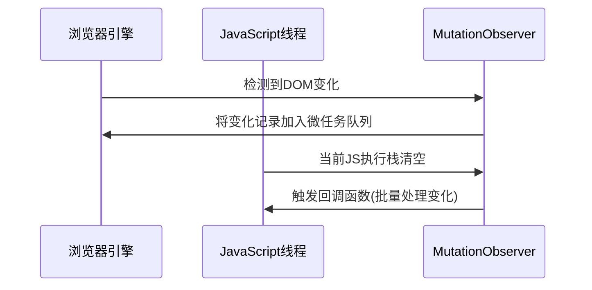

## javascript
### 数据类型
- 哪些
    - 基本数据类型：
        Number(数字),String(字符串),Boolean(布尔),Symbol(符号),null(空),undefined(未定义)在内存中占据固定大小，保存在栈内存中
        （
        字符串： 存在堆里，栈中为引用地址，如果存在相同字符串，则引用地址相同。
        数字：小整数存在栈中，其他类型存在堆中。
        ）
    - 引用数据类型
        Object(对象)、Function(函数)。其他还有Array(数组)、Date(日期)、RegExp(正则表达式)
- 判断方法
    - typeof
        优点：能够快速区分基本数据类型
        缺点：不能将Object、Array和Null区分，都返回object
    - instanceof
        优点：能够区分Array、Object和Function，适合用于判断自定义的类实例对象
        缺点：Number，Boolean，String基本数据类型不能判断
    - Object.prototype.toString.call() 
        精准判断数据类型
### 栈 & 堆
- 栈
	- 先进后出；
	- 由操作系统自动分配释放；
	- 存放函数的参数值，局部变量的值等；
	- 栈的生长方向向下，内存地址由高到低
- 堆
	- 队列优先，先进先出；
	- 动态分配的空间，一般由程序员分配释放；若不释放，程序结束时可能由OS回收；
	- 分配方式类似于链表；
	- 堆的生长方向向上，内存地址由低到高；
### 闭包
- 原理
	闭包是指有权访问另一个函数作用域中的变量的函数（变量的作用域属于函数的作用域）
- 条件
	函数的嵌套
	内部函数引用外部函数的局部变量，延长外部函数的变量生命周期
- 优点 & 缺点
	优点：封装私有变量;实现js的模块；延长局部变量的生命周期
	缺点：会导致函数的变量一直保存在内存中，过多闭包可能会导致内存泄漏
	场景：防抖，计数
### 原型 & 原型链

- 关系
	每个函数对象都有一个显示原型prototype
	每个实例对象都有一个隐式原型\_proto\_
	实例对象的\_proto\_指向对应函数对象的prototype
	
- 原型
	分为：显式原型prototype，隐式原型\__proto\__
	每个函数对象都有一个prototype属性，这个属性指向函数的原型对象；
	使用原型对象的好处是所有对象实例 共享它所包含的属性和方法。
	Person.prototype.constructor = Person
	per.\_proto\_ = Person.prototype
	
	Person.prototype.\_proto\_=Object.prototype
	
- 原型链
	函数的原型对象(prototype)的构造函数(constructor) 默认指向函数本身；
	原型对象(prototype)除了有原型属性外，为了实现继承，还有一个原型链指针\_proto\_;
	该指针指向上一层的原型对象(prototype)，而上一级的原型对象结构依然类似；
	因此可以利用\_proto\_一直指向Object的原型对象(prototype)上；
	Object的原型对象(prototype)的原型链指针Object.prototype.\_proto_ = null
	
	表示原型链的顶端；
	这样就形成了js原型链的继承；
	
- 作用
	原型链主要是解决继承问题。
	每个对象拥有一个原型对象，通过\_proto\_指针指向其原型对象，并从中继承方法和属性。。。
	
- prototype、\_proto\_区别：
    prototype是构造函数的属性；
    \_proto\_是每个实例都有的属性，可以访问[[prototype]]属性
    实例的\_proto\_与其构造函数的prototype指向的是同一个对象
    
- 特点
	js对象是通过引用来传递的，创建的每个新对象实体中并没有属于自己的原型副本；
	当我们修改原型是，与之相关的对象也会继承这一改变；
### 继承
- 原型链继承
	Child.prototype = new Parent()
- 构造函数继承
	function Child(args) {
        Parent.call(this, args)
    }
- 组合继承（原型链+构造函数）
	function Child(args1, args2) {
      this.args2 = args2
      Parent.call(this.args1)
    }
    Child.prototype = new Parent()
    Child.prototype.constructor = Child
- 较为完整的继承
```
function inherit(Child, Parent) {
  // 继承原型上的属性
  Child.prototype = Object.create(Parent.prototype)
  // 修复constructor
  Child.prototype.constructor = Child
  // 存储超类
  Child.super = Parent
  // 静态属性继承
  if (Object.setPrototypeOf) {
    // setPrototypeOf es6
    // 相当于Child.__proto__ = Parent
    Object.setPrototypeOf(Child, Parent)
  } else if (Child.__proto__) {
    // __proto__ es6引入，但是部分浏览器已支持
    Child.__proto__ = Parent
  } else {
    // 兼容IE10等陈旧浏览器
    // 将Parent上的静态属性和方法拷贝一份到Child上，不会覆盖Child的方法
    for (let k in Parent) {
      if(Parent.hasOwnProperty(k) && !(k in Child)) {
        Child[k] = Parent[k]
      }
    }
  }
}
```
- call & apply & bind
	- call
		fn.call(obj, arg1, arg2,...)
	- apply
		fn.apply(obj, [arg1, arg2, ...])
	- bind
		会创建一个新的函数 b = a.bind(obj)
- 面试
	配合hasOwnProperty
```js
class Person {
  constructor(name, age) {
    this.name = name
    this.age = age
  }
  sayHello() { // 普通函数绑定在构造函数原型(\_proto\_)上
    console.log(this.name)
  }
  myAge = () => { // 箭头函数在构造函数上
    console.log(this.age)
  }
}
const p = new Person('hello', 18)
p.sayHello() // hello
p.myAge() // 18
console.log(p.hasOwnProperty('sayHello')) // false
console.log(p.__proto__.hasOwnProperty('sayHello')) // true
console.log(p.hasOwnProperty('myAge')) // true
console.log(p.__proto__.hasOwnProperty('myAge')) // false
```
### ES6新特性
- #### es6 与es5的class有什么区别

    - es6
        内部所有定义的方法都是不可枚举的
        必须使用new调用
        不存在变量提升
        默认是严格模式
        子类必须在父类的构造函数中调用super()，这样才有this对象；
    - es5
        es5中类继承关系是相反的，先有子类this，然后在父类的方法应用在this上
    - map & object的区别
    	- map
    		- map的key为任意类型
    		- 保持元素插入时的顺序
    	- object
    		- object的key只能是string或symbol类型
    		- 不根据插入时的顺序

- #### 箭头函数
  没有this，this指向函数定义时的作用域，不能作为构造函数

- #### promise
    原理：异步回调
    异步解决方案，解决回调地狱
    同时发起，promise.all
    如何实现
    三种状态：fulfilled，pending，rejected
    特性：状态不可变
    缺点：无法取消promise；pending时无法知道在哪个阶段
    then原理：返回一个新的promise

    - reject & catch
      - reject
      	抛出异常
      	reject是Promise的方法
      	reject后的东西，一定会进then中第二个回调，若没有第二个回调，则进catch
      - catch
      	处理异常
      	catch是Promise实例的方法
      	网络异常直接进入catch

    ```mermaid
    graph TD
        A[初始Promise] --> B[then 回调1]
        B --> C[新Promise1]
        C --> D[then 回调2]
        D --> E[新Promise2]
        E --> F[catch 处理]
        
        style A fill:#f9f,stroke:#333
        style C fill:#bbf,stroke:#333
        style E fill:#bbf,stroke:#333
        style F fill:#fbb,stroke:#333
    ```

    - `.then` 的第二个参数 vs `.catch`

      ## 核心区别对比

      | 特性             | `.then` 的第二个参数              | `.catch` 方法                     |
      | :--------------- | :-------------------------------- | :-------------------------------- |
      | **语法位置**     | 紧随成功处理函数之后              | 链式调用的末端                    |
      | **捕获范围**     | 仅捕获前一个 Promise 的 rejection | 捕获链中所有未处理的 rejection    |
      | **链式行为**     | 处理后返回 resolved Promise       | 处理后返回 resolved Promise       |
      | **错误穿透**     | 不会穿透到后续 catch              | 会穿透后续 then 直到被 catch 捕获 |
      | **最佳实践场景** | 特定操作的错误恢复                | 全局错误处理                      |

- #### async/await

  async 函数返回一个 Promise 对象；
  当函数执行的时候，一旦遇到 await 就会先返回；
  等到触发的异步操作完成，再执行函数体内后面的语句。
  可以理解为，是让出了线程，跳出了 async 函数体。

  - 底层实现机制（基于生成器）

    async/await 实际是 Generator + Promise 的语法糖

    ```js
    // 生成器版本
    function* fetchGenerator() {
      const data = yield fetch('/data');
      const processed = yield process(data);
      return processed;
    }
    
    // async/await 版本
    async function fetchAsync() {
      const data = await fetch('/data');
      const processed = await process(data);
      return processed;
    }
    ```

  - 底层架构

    - 转换层

      - 将async函数转换为生成器函数
      - 将await转换为yield

    - 执行层

      - 自动执行器管理生成迭代器
      - Promise集成处理异步操作

    - 运行时优化

      - V8引擎的零成本await（当 await 的值已经确定时，V8 会跳过微任务队列）

        ```c++
        // V8 源码简化 (src/async-await.cc)
        RUNTIME_FUNCTION(Runtime_AsyncFunctionAwait) {
          Handle<JSPromise> promise = ...;
          
          if (promise->status() == Promise::kFulfilled) {
            // 已解决：直接返回值，不创建微任务
            return promise->result();
          } else if (promise->status() == Promise::kRejected) {
            // 已拒绝：直接抛出错误
            return Throw(promise->result());
          } else {
            // 未决：创建微任务
            MicrotaskQueue::EnqueueMicrotask(createResumeMicrotask(...));
          }
        }
        ```

      - 隐藏类优化内存布局

      - 快速路径处理常见场景

    - 错误处理

      - 通过生成器的throw方法传递错误
      - 最终转换为Promise rejection

- #### generator
### this
- 作为普通函数执行时，this指向window；
- 函数作为对象的方法被调用时，this指向该对象；
- 构造函数调用，this指向返回的这个对象；
- 箭头函数的this绑定看的是this所在函数定义的对象；如果有嵌套，this绑定到最近一层的对象上；
- 基于Function.prototype上的apply，call，bind调用模式：
	- 修改this的指向
### 节流 & 防抖
- 节流
	在一定时间内执行一次，函数会先立即执行一次，之后保证在一定时间间隔内只执行一次
	
	```js
	function throttle(fn, delay) {
	  let lastTime = 0
	  return function () {
	    let nowTime = Date.now()
	    if (nowTime - lastTime > delay) {
	      setTimeout(() => {
	        fn.apply(this)
	        lastTime = nowTime
	      }, delay);
	    }
	  }
	}
	```
	
	```js
	/**
	 * 优化后的节流函数
	 * @param {Function} fn 需要节流的函数
	 * @param {number} delay 节流时间（毫秒）
	 * @param {boolean} [trailing=true] 是否在节流结束后执行最后一次调用
	 * @returns {Function} 节流处理后的函数
	 */
	function throttle(fn, delay, trailing = true) {
	  let lastExecTime = 0;
	  let timer = null;
	  let pending = false;
	  
	  return function(...args) {
	    const now = Date.now();
	    const context = this;
	    
	    // 立即执行条件：距离上次执行超过延迟时间
	    if (now - lastExecTime >= delay) {
	      // 清除等待中的执行
	      if (timer) {
	        clearTimeout(timer);
	        timer = null;
	      }
	      
	      // 执行函数并更新最后执行时间
	      fn.apply(context, args);
	      lastExecTime = now;
	      pending = false;
	    } 
	    // 处理尾部执行
	    else if (trailing && !pending) {
	      pending = true;
	      
	      // 计算剩余等待时间
	      const remaining = delay - (now - lastExecTime);
	      
	      timer = setTimeout(() => {
	        fn.apply(context, args);
	        lastExecTime = Date.now();
	        timer = null;
	        pending = false;
	      }, remaining);
	    }
	  };
	}
	```
	
	
	
- 防抖
	多次触发函数只会在最后一次执行
	
	```js
	function debounce(fn, delay) {
	  let timer = null
	  return function () {
	    clearTimeout(timer)
	    timer = setTimeout(() => {
	      fn.apply(this)
	    }, delay)
	  }
	}
	```
	
	```js
	/**
	 * 优化的防抖函数
	 * @param {Function} func 需要防抖的函数
	 * @param {number} [wait=500] 防抖等待时间（毫秒）
	 * @param {boolean} [immediate=false] 是否立即执行
	 * @returns {Function} 防抖处理后的函数
	 */
	function debounce(func, wait = 500, immediate = false) {
	  let timeout = null;
	  
	  const debounced = function(...args) {
	    const context = this;
	    const later = function() {
	      timeout = null;
	      if (!immediate) {
	        func.apply(context, args);
	      }
	    };
	    
	    const callNow = immediate && !timeout;
	    
	    // 清除现有定时器
	    if (timeout) {
	      clearTimeout(timeout);
	    }
	    
	    // 设置新定时器
	    timeout = setTimeout(later, wait);
	    
	    // 立即执行
	    if (callNow) {
	      func.apply(context, args);
	    }
	  };
	  
	  // 添加取消方法
	  debounced.cancel = function() {
	    if (timeout) {
	      clearTimeout(timeout);
	      timeout = null;
	    }
	  };
	  
	  return debounced;
	}
	```
	
	```typescript
	
	const debounce = (func:ReturnType<typeof Function>, wait?: number, immediate?: boolean) => {
	  wait = wait || 500
	  let timeout
	  return function() {
	    const ctx = this
	    const args = arguments
	    const callNow = immediate && !timeout
	    timeout && clearTimeout(timeout)
	    timeout = setTimeout(() => {
	      timeout = null
	      if(!immediate) {
	        func.apply(ctx, args)
	      }
	    }, wait)
	
	    if (callNow) {
	      func.apply(ctx, args)
	    }
	  }
	}
	```
	
- 节流与防抖对比
	
	| **特性**     | **节流(throttle)**       | **防抖(debounce)**     |
	| :----------- | :----------------------- | :--------------------- |
	| **目标**     | 限制执行频率             | 限制执行次数           |
	| **执行时机** | 固定间隔执行             | 停止触发后执行         |
	| **适用场景** | 滚动、调整大小、鼠标移动 | 搜索输入、窗口调整结束 |
	| **立即执行** | 总是立即首次执行         | 可配置是否立即执行     |
	| **尾部执行** | 可配置是否尾部执行       | 总是尾部执行           |
	| **执行次数** | 保证固定频率执行         | 只执行最后一次         |
	| **内存占用** | 较低                     | 较高（需维护定时器）   |
	
- ```mermaid
  sequenceDiagram
      participant 用户操作
      participant 节流函数
      participant 防抖函数
      
      用户操作->>节流函数: 触发事件
      节流函数->>节流函数: 立即执行（首次）
      
      用户操作->>节流函数: 快速连续触发
      节流函数->>节流函数: 忽略中间触发
      
      用户操作->>节流函数: 停止触发
      节流函数->>节流函数: 尾部执行（可选）
      
      用户操作->>防抖函数: 触发事件
      防抖函数->>防抖函数: 立即执行（可选）
      
      用户操作->>防抖函数: 快速连续触发
      防抖函数->>防抖函数: 重置定时器
      
      用户操作->>防抖函数: 停止触发
      防抖函数->>防抖函数: 等待延迟后执行
  ```

- 场景
	节流：滚动加载更多，高频点击，表单重复提交
	防抖：搜索框输入
### 事件代理
- 原理
	事件冒泡 和 事件委托
- 实现
	利用事件冒泡，将原本注册在子元素的事件注册在父元素上；
	点击子元素时，发现本身没有相应事件，就会在父元素查找对应事件；
- 优点
	- 减少DOM操作，提高性能；
	- 随时可以添加子元素，添加的子元素会自动有相应的处理事件。
	
### new一个对象全过程
- 创建一个空对象obj，作为执行new构造函数之后，返回的对象实例；
- 将obj的原型_proto_指向构造函数的prototype属性；
- 将构造函数内部的this指向obj，并执行构造函数逻辑；
- 根据构造函数执行逻辑，返回obj或者构造函数的显式返回值（如果return的是非对象，则忽略返回值；如果是对象，则返回该对象）
### 自定义new
```js
function newFun(...args) {
  // 取出args的第一个参数，即目标的构造函数
  const constructor = args.shift() // [Function: Person]（Person为目标函数名称）
  // 创建一个空对象obj，且继承构造函数的prototype属性
  const obj = Object.create(constructor.prototype) // obj.__proto__ === constructor.prototype
  // 将构造函数内部this指向obj，并执行构造函数，返回结果
  const result = constructor.apply(obj, args)
	// 判断返回结果，如果为对象类型，则返回result；否则返回obj
  return (typeof result === 'object' && result !== null) ? result : obj
}
```
### 深拷贝 & 浅拷贝
- 浅拷贝
	复制一层对象的属性，并不包括对象里引用类型的数据；当改变拷贝对象的引用类型时，源对象也会改变；
- 深拷贝
	重新开辟一个空间，需要递归拷贝对象里的引用；直到子属性都为基本类型；
	两个对象对应两个不同的地址，互不影响；
	- 实现
        - JSON.parse() JSON.stringify()
            缺点： 
            - 拷贝之后，对象的构造函数都会变成Object
            - RegExp无法实现拷贝
            - function直接消失
            - 自定义
```js
function deepCopy(obj) {
  let result = Array.isArray(obj) ? [] : {};
  for (let key in obj) {
    if (obj.hasOwnProperty(key)) {
      if (typeof obj[key] === 'object' && obj[key]!==null) {
        result[key] = deepCopy(obj[key]);   //递归复制
      } else {
        result[key] = obj[key];
      }
    }
  }
  return result;
}
```
```js
a = window.structuredClone(b);
```

```js
const _ = require("lodash");
const clone = _.cloneDeep(yourObject);
```

### 数组转tree结构

```js
/**
 * 利用对象浅拷贝 非递归实现，时间复杂度O(n)
 * @param {原数组} arr
 * @param {根节点id} rootId
 * @param {id} id
 * @param {pid} pid
 */
function jsonArray2Tree(arr, rootId, id, pid) {
  // 浅复制出一份数据并加上 children 字段
  let obj = {}
  arr.forEach(v => {
    obj[v[id]] = v
    obj[v[id]].children = []
  })
  let tree = []
  arr.forEach(v => {
    if (v[pid] == rootId) {
      tree.push(v)
    }
    // 拿此刻循环值的 pid 去复制数据里面找到对应父级然后塞到它的 children 中
    obj[v[pid]] && obj[v[pid]].children.push(v)
  })
  return tree
}
```
### 内存泄漏
	闭包
	循环引用
	Dom事件
	全局变量
### 垃圾回收
- 标记清除
	当变量进入执行环境时，被标记为‘进入环境’；
	当变量离开执行环境时，会被标记为‘离开环境’；
	垃圾回收器会销毁那些带标记的值，并回收他们占用的内存空间
- 谷歌浏览器：
	“查找引用”，浏览器不定时去查找当前内存的引用，如果没有被占用了，浏览器会回收它；如果被占用，就不能回收。
- IE浏览器
	“引用计数法”，当前内存被占用一次，计数累加1次，移除占用就减1，减到0时，浏览器就回收它。
### == & ===
-  == 
	如果两者类型不同，会先进行类型转换，再判断
	1、先判断两者类型是否相同，如果相同，判断值是否相等
	2、如果类型不同，进行类型转换
	3、判断比较的是否是null或undefined，如果是，将字符串转成number
	4、判断其中一方是否为Boolean，如果是，将Boolean转成number再判断
	判断其中一方是否object且另一方为string，number，symbol；如果是，将object转成原始类型再进行判断
- ===
	没有进行类型转换，只有类型相同且值相等，才会返回true
	复杂数据类型，比较的是引用地址
### typescript
- 是什么
- 为什么需要typescript
- 解决了什么问题
- 泛型
	考虑api的可复用性
- 接口
	对函数和变量的一种约束
### js 和 css 的阻塞问题分析

- css
  - 不会阻塞dom树的构建；
  - 会阻塞页面的显示；
    浏览器在构建cssom的过程，不会渲染任何已处理的内容；即使dom已经解析完毕，只要cssom没构建好，页面也不会显示；
- js
  - 会阻塞dom树的构建；
  - 不会阻塞位于它之前的dom元素渲染；

### async & defer
- 普通
	浏览器在解析HTML时，若遇到一个没有任何属性的script标签，就会暂停解析；
	先发送网络请求，获取该js脚本内容，然后让js引擎执行该代码；
	代码执行完毕后恢复解析；
	
- async
	请求该脚本的网络请求是异步的，不会阻塞浏览器解析HTML代码；
	一旦网络请求回来，若HTML还没解析完，浏览器会暂停解析；
	先让js引擎执行代码；
	执行完毕后再进行解析；
	
- defer
	获取该脚本的网络请求也是异步的，不会阻塞浏览器介解析HTML；
	一旦网络请求回来，若此时HTML还没解析完；
	浏览器等待HTML解析完，在执行js代码；
	

### MutationObserver

#### 作用

用于异步监听DOM树的变化



#### 使用方式

- 创建观察者模式

  ```js
  // 创建回调函数
  const callback = (mutationsList, observer) => {
      for(const mutation of mutationsList) {
          if (mutation.type === 'childList') {
              console.log('子节点变化:', mutation.addedNodes, mutation.removedNodes);
          }
          else if (mutation.type === 'attributes') {
              console.log(`属性 ${mutation.attributeName} 变化:`, 
                           mutation.oldValue, 
                           mutation.target.getAttribute(mutation.attributeName));
          }
      }
  };
  
  // 创建观察者实例
  const observer = new MutationObserver(callback);
  ```

- 配置观察选项

  ```js
  const config = {
      subtree: true,         // 监视所有后代节点
      childList: true,       // 监视子节点变化
      attributes: true,      // 监视属性变化
      attributeOldValue: true, // 记录旧属性值
      attributeFilter: ['class', 'data-id'], // 只监视特定属性
      characterData: false,  // 不监视文本节点变化
      characterDataOldValue: false
  };
  ```

- 启动和停止观察

  ```js
  // 开始观察目标节点
  const targetNode = document.getElementById('app');
  observer.observe(targetNode, config);
  
  // 停止观察
  observer.disconnect();
  
  // 获取未处理的变更
  const mutations = observer.takeRecords();
  ```

- 批量变化处理

  ```js
  const observer = new MutationObserver((mutations) => {
      // 使用requestAnimationFrame减少重绘
      requestAnimationFrame(() => {
          console.log(`批量处理 ${mutations.length} 个变更`);
          // 实际处理逻辑...
      });
  });
  ```


### requestIdleCallback & requestAnimationFrame & setTimeout

- #### setTimeout

  - 定义
    - 在指定延迟后执行回调函数，属于宏任务
  - 特点
    - 无法保证精确执行时间（可能因主线程阻塞而延迟）
    - 适合非视觉相关的延迟任务
  - 缺点
    - 频繁使用可能导致性能问题（如：动画卡顿）
    - 与屏幕刷新率不同步，易导致动画丢失

- #### requestAnimationFrame

  - 定义

    - 在浏览器下一次重绘前执行回调函数，专门为高性能动画设计

  - 特点

    - 与屏幕刷新率同步（通常60HZ，即每16.7ms执行一次）
    - 自动暂停在后台标签页，节省资源
    - 提供精确的时间戳参数（DOMHighResTimeStamp），用于计算帧率

  - 应用场景

    - 动画（CSS、canvas）
    - 高频视觉更新
    - 布局测量（避免强制同步布局）

  - 示例

    - 一次性渲染十万条数据
      - 每次电脑屏幕 16.7ms 后刷新一下，定时器就会产生 20 个`li`，`dom`结构的出现和屏幕的刷新保持了一致
      - `fragment`是虚拟文档碎片，我们一次`for`循环产生 20 个`li`的过程中可以全部把真实`dom`挂载到`fragment`上，然后再把`fragment`挂载到真实`dom`上，这样原来需要回流十万次，现在只需要回流`100000 / 20`次

    [100000列表渲染 - 码上掘金](https://code.juejin.cn/pen/7538081449229058058)

    ```js
    <script>
        const total = 100000
        let ul = document.getElementById('container')
        let once = 20
        let page = total / once
        function loop(curTotal) {
            if (curTotal <= 0) return 
            let pageCount = Math.min(curTotal, once) 
            window.requestAnimationFrame(() => {
                let fragment = document.createDocumentFragment() // 创建一个虚拟文档碎片
                for (let i = 0; i < pageCount; i++) {
                    let li = document.createElement('li')
                    li.innerHTML = ~~(Math.random() * total)
                    fragment.appendChild(li) // 挂到fragment上
                }
                ul.appendChild(fragment) // 现在才回流
                loop(curTotal - pageCount)
            })
        }
        loop(total)
    </script>
    ```

    

- #### requestIdleCallback

  - 定义
    - 在浏览器空闲时期执行低优先级任务，避免阻塞关键渲染
  - 特点
    - 接收IdleDealine参数：包含
      - timeRemaining()：当前帧剩余空闲时间（通常<=50ms）
      - didTimeout：任务是否因超时被强制执行
    - 可配置超时时间（{timeout： N}），超时后强制执行
  - 应用场景
    - 非关键任务（如埋点，数据预加载）
    - 耗时计算（拆分多个空闲任务执行）
    - 后台数据同步（如保存草稿）

  - 示例

    ```js
    requestIdleCallback((deadline) => {
      while (deadline.timeRemaining() > 0) {
        doLowPriorityTask(); // 拆分任务
      }
    }, { timeout: 2000 }); // 2秒超时
    ```

- #### 区别

  | **特性**           | `setTimeout`   | `requestAnimationFrame` (rAF) | `requestIdleCallback` (rIC) |
  | :----------------- | :------------- | :---------------------------- | :-------------------------- |
  | **触发时机**       | 指定延迟后     | 下一帧渲染前                  | 浏览器空闲时                |
  | **执行频率**       | 自定义         | 同步屏幕刷新率（≈60fps）      | 取决于空闲时间              |
  | **是否阻塞渲染**   | 可能阻塞       | 不阻塞（在渲染前执行）        | 完全不阻塞                  |
  | **适用任务优先级** | 中/低          | **高**（视觉更新）            | **低**（后台任务）          |
  | **资源消耗**       | 可能浪费资源   | 高效（后台自动暂停）          | 高效（仅空闲时运行）        |
  | **精确时间控制**   | ❌ 延迟不精确   | ✅ 提供高精度时间戳            | ✅ 提供剩余空闲时间          |
  | **典型场景**       | 延迟逻辑、轮询 | 动画、布局测量                | 日志上报、预加载            |

- #### 示例

  计算从0到2000000000的累加
  
  start = 0; end = 2000000000;

  - Web Worker

    ```js
    function runWithWorker() {
        const w1 = new Worker('./index-worker.js');
        w1.postMessage({ start, end });
        w1.onmessage = (event) => {
            console.log('main', event)
        }
    }
    // index-worker.js
    self.onmessage = function(event) {
      console.log('web worker',event)
      const { start, end } = event.data;
      let sum = 0;
      for(let i=start;i<=end;i++) {
        sum += i;
      }
      self.postMessage('sum', sum)
    }
    ```

    

  - requestAnimationFrame

    ```js
    function runWithRAF() {
      // 初始化变量
      let current = start; // 当前处理的位置
      let sum = 0; // 累加结果
      const chunkSize = 10000000; // 每块处理1千万个数字
      function doChunk() {
        // 记录帧开始时间
        const frameStart = performance.now();
        // 计算当前块的结束位置
        const chunkEnd = Math.min(current + chunkSize, end);
        // 处理当前块
        while (current <= chunkEnd) {
          sum += current++; // 累加数字并移动指针
        }
        // 更新进度
        const progress = (current / end) * 100;
        updateProgress(progress, current);
        // 检查是否完成
        if (current > end) {
          showResult(sum);
          return;
        }
        // 智能调度下一块
        const elapsed = performance.now() - frameStart;
        if (elapsed < 10) {
          doChunk(); // 当前帧还有时间，立即执行下一块
        } else {
          requestAnimationFrame(doChunk); // 等待下一帧
        }
      }
      // 启动第一块
      requestAnimationFrame(doChunk);
    }
    ```

    - 为什么if (elapsed < 10)

      1. 帧时间预算分配

      | 时间段         | 分配时间 | 用途                       |
      | :------------- | :------- | :------------------------- |
      | JavaScript执行 | ≤10ms    | 执行应用逻辑、计算任务     |
      | 浏览器渲染工作 | ≥6.67ms  | 样式计算、布局、绘制、合成 |
      | **总帧时间**   | 16.67ms  | 实现60FPS的流畅体验        |

    `if (elapsed < 10)` 这个条件判断是确保页面流畅性的关键优化策略：

    1. **安全边界**：为浏览器渲染保留最少6ms时间
    2. **性能平衡**：在充分利用帧时间和保证流畅性之间取得平衡
    3. **预防卡顿**：避免JavaScript独占帧时间导致丢帧
    4. **响应保障**：确保用户交互能得到及时响应

    这个10ms阈值是Web性能优化的最佳实践之一，它源自多年积累的经验和对浏览器渲染管线的深入理解

  - requestIdleCallback

    ```js
    function runWithRIC () {
        let sum = 0;
        let current = 0;
        const chunkSize = 1000000; // 每块处理1百万次计算
        function doChunk (deadline) {
            while (current <= end && deadline.timeRemaining() > 0) {
                const chunkEnd = Math.min(current + chunkSize, end);
                for (let i = current; i <= chunkEnd; i++) {
                    sum += i;
                }
                current = chunkEnd + 1;
                // 更新进度
                const progress = (current / end) * 100;
                console.log(progress);
                if (current > end) {
                    console.log('计算完成', sum);
                    return;
                }
            }
            requestIdleCallback(doChunk);
        }
        requestIdleCallback(doChunk);
    }
    ```

    