### Web Worker

#### 基本概念

- 是什么
  - 浏览器提供的JavaScript多线程解决方案
  - 在后台线程中运行脚本，不阻塞主线程
  - 无法直接操作DOM，与主线程通过消息传递通信
  
- 为什么需要
  - 解决JavaScript单线程的限制
  
  - 避免复杂计算阻塞UI渲染
  
  - 提高应用性能和响应速度
  
  - 浏览器主线程一次只能处理一个任务（任务按照队列执行）。**当任务超过某个确定的点时，准确的说是50毫秒，就会被称为长任务(Long Task)**  。当长任务在执行时，如果用户想要尝试与页面交互或者一个重要的渲染更新需要重新发生，那么浏览器会等到Long Task执行完之后，才会处理它们。结果就会导致交互和渲染的延迟。
  
    导致的问题
  
    - 可交互时间 延迟
    - 严重不稳定的交互行为 (轻击、单击、滚动、滚轮等) 延迟（High/variable input latency）
    - 严重不稳定的事件回调延迟（High/variable event handling latency）
    - 紊乱的动画和滚动（Janky animations and scrolling）
  
- web worker类型
  - 专用worker（dedicated worker）：只被创建它的脚本使用
  - 共享worker（shared worker）：可被多个脚本共享
  - 服务worker（service worker）：用于离线缓存，推送通知等

#### 生命周期



```mermaid
graph LR
A[主线程创建Worker] --> B[Worker初始化]
B --> C[消息传递]
C --> D[任务处理]
D --> E[发送结果]
E --> F[销毁Worker]
```

#### 关键特性与限制

- 支持的功能
  - setTimeout、setInterval
  - XMLHttpRequest、fetch
  - WebSocket
  - IndexedDB
  - importScripts()（加载外部脚本）
  - Navigator（对象部分属性）
- 限制
  - 无法直接访问DOM
  - 无法使用window、document、parent对象
  - 无法访问主线程作用域变量
  - 同源策略限制

#### 核心API

```js
// 主线程代码
const worker = new Worker('worker.js');
// 发送消息给 Worker
worker.postMessage({ type: 'CALCULATE', data: 100 });
// 接收 Worker 消息
worker.onmessage = (event) => {
  console.log('Result:', event.data);
};
// 错误处理
worker.onerror = (error) => {
  console.error('Worker error:', error);
};
// 终止 Worker
worker.terminate();
```

```js
// worker.js
self.onmessage = (event) => {
  if (event.data.type === 'CALCULATE') {
    const result = heavyCalculation(event.data.data);
    self.postMessage(result);
  }
};
function heavyCalculation(n) {
  // 复杂计算逻辑
  let sum = 0;
  for (let i = 0; i <= n; i++) {
    sum += i;
  }
  return sum;
}


// 终止 Worker
self.close();
```

### 示例

- 预加载资源文件

  主进程

  ```js
  // 资源列表
  const resources = [
      { id: 'css1', type: 'css', name: 'Bootstrap CSS', url: 'https://cdn.jsdelivr.net/npm/bootstrap@5.3.0/dist/css/bootstrap.min.css' },
      { id: 'img1', type: 'image', name: 'Large Image 1', url: 'https://picsum.photos/1200/800?random=1' },
      { id: 'img2', type: 'image', name: 'Large Image 2', url: 'https://picsum.photos/1200/800?random=2' },
      { id: 'js1', type: 'script', name: 'Utility Library', url: 'https://cdn.jsdelivr.net/npm/lodash@4.17.21/lodash.min.js' },
      { id: 'font1', type: 'font', name: 'Google Font', url: 'https://fonts.googleapis.com/css2?family=Roboto:wght@400;' },
      { id: 'css2', type: 'css', name: 'Icons CSS', url: 'https://cdnjs.cloudflare.com/ajax/libs/font-awesome/6.4.0/css/all.min.css' },
      { id: 'img3', type: 'image', name: 'Large Image 3', url: 'https://picsum.photos/1200/800?random=3' }
  ];
  // 初始化 Web Worker
  function initWorker () {
      if (worker) {
          return;
      }
      try {
          worker = new Worker('preload-file-worker.js');
          worker.onmessage = (e) => {
              const { id, type } = e.data;
              if (e.data.error) {
                  updateResourceStatus(id, 'error');
                  updateStatus(`加载失败: ${id} - ${e.data.error}`, 'error');
              } else {
                  updateResourceStatus(id, 'loaded');
                  updateStatus(`已加载: ${id}`, 'success');
                  // 在实际应用中，这里可以处理加载的资源 
                  // 使用预加载资源方法
              }
          };
          updateStatus('Web Worker 已初始化', 'success');
      } catch (error) {
          updateStatus(`创建Worker失败: ${error.message}`, 'error');
      }
  }
  // 开始预加载资源
  function startPreloading () {
      if (!worker) {
          updateStatus('请先初始化Worker', 'error');
          return;
      }
      // 开始通过Worker加载
      resources.forEach(resource => {
          updateResourceStatus(resource.id, 'loading');
          worker.postMessage({
              id: resource.id,
              type: resource.type,
              url: resource.url
          });
      });
      updateStatus('开始在Worker中预加载资源...', 'info');
  }
  // 终止 Worker
  function terminateWorker () {
      if (worker) {
          worker.terminate();
          worker = null;
          updateStatus('Web Worker 已终止', 'info');
      }
  }
  ```

  preload-file-worker.js

  ```js
  self.onmessage = async (e) => {
    const { type, url, id } = e.data;
    try {
      switch (type) {
        case 'css':
          const cssResponse = await fetch(url);
          const cssText = await cssResponse.text();
          self.postMessage({ id, type, content: cssText });
          break;
        case 'image':
          const imgResponse = await fetch(url);
          const blob = await imgResponse.blob();
          const imageBitmap = await createImageBitmap(blob);
          self.postMessage({ id, type, imageBitmap }, [imageBitmap]);
          break;
        case 'script':
          // 使用importScripts同步加载
          importScripts(url);
          self.postMessage({ id, type, status: 'loaded' });
          break;
        case 'font':
          const fontResponse = await fetch(url);
          const fontBuffer = await fontResponse.arrayBuffer();
          const base64Font = arrayBufferToBase64(fontBuffer);
          self.postMessage({ id, type, fontData: base64Font });
          break;
      }
    } catch (error) {
      self.postMessage({ id, type, error: error.message });
    }
  };
  function arrayBufferToBase64 (buffer) {
    let binary = '';
    const bytes = new Uint8Array(buffer);
    const len = bytes.byteLength;
    for (let i = 0; i < len; i++) {
      binary += String.fromCharCode(bytes[i]);
    }
    return btoa(binary);
  }
  ```

  使用预加载资源

  ```js
  function useCss() {
      // 创建新的style标签并添加CSS内容
      const style = document.createElement('style');
      style.textContent = xxx;
      document.head.appendChild(style);
  }
  function useImages() {
      imageIds.forEach(id => {
          const blob = xxx;
          // 创建可用的图片URL
          const url = URL.createObjectURL(blob);
          const img = document.createElement('img');
          img.src = url;
          document.body.appendChild(img);
      });
  }
  function useScript() {
      // 创建新的script标签并添加脚本内容
      const script = document.createElement('script');
      script.textContent = 'xxx';
      document.body.appendChild(script);
      
      // 检查脚本是否可用
      setTimeout(() => {
          if (xxx) {
              console.log('Lodash已加载');
          }
      }, 100);
  }
  ```

### Service Worker

#### 生命周期

- ##### 注册

  ```js
  // 在主线程中注册 Service Worker
  if ('serviceWorker' in navigator) {
    window.addEventListener('load', () => {
      navigator.serviceWorker.register('/sw.js')
        .then(registration => {
          console.log('SW注册成功:', registration)
        })
        .catch(error => {
          console.log('SW注册失败:', error)
        })
    })
  }
  ```

- ##### 安装

  ```js
  // sw.js - Service Worker 文件
  const CACHE_NAME = 'my-app-v1'
  const urlsToCache = [
    '/',
    '/static/css/main.css',
    '/static/js/main.js',
    '/images/logo.png'
  ]
  self.addEventListener('install', event => {
    console.log('Service Worker 安装中...')
    event.waitUntil(
      caches.open(CACHE_NAME)
        .then(cache => {
          console.log('缓存已打开')
          return cache.addAll(urlsToCache)
        })
    )
    // 强制激活新的 Service Worker
    self.skipWaiting()
  })
  ```

- ##### 激活

  ```js
  self.addEventListener('activate', event => {
    console.log('Service Worker 激活中...')
    event.waitUntil(
      caches.keys().then(cacheNames => {
        return Promise.all(
          cacheNames.map(cacheName => {
            // 删除旧版本缓存
            if (cacheName !== CACHE_NAME) {
              console.log('删除旧缓存:', cacheName)
              return caches.delete(cacheName)
            }
          })
        )
      })
    )
    // 立即控制所有客户端
    self.clients.claim()
  })
  ```

- ##### 拦截请求

  ```js
  self.addEventListener('fetch', event => {
    event.respondWith(
      caches.match(event.request)
        .then(response => {
          // 缓存命中，返回缓存
          if (response) {
            return response
          }
          // 缓存未命中，请求网络
          return fetch(event.request).then(response => {
            // 检查响应是否有效
            if (!response || response.status !== 200 || response.type !== 'basic') {
              return response
            }
            // 克隆响应（因为响应流只能消费一次）
            const responseToCache = response.clone()
            
            caches.open(CACHE_NAME)
              .then(cache => {
                cache.put(event.request, responseToCache)
              })
            return response
          })
        }
      )
    )
  })
  ```

#### 高级功能实现

- ##### 缓存策略

  - Cache First策略

    ```js
    // 优先使用缓存，适合静态资源
    self.addEventListener('fetch', event => {
      if (event.request.url.includes('/static/')) {
        event.respondWith(
          caches.match(event.request)
            .then(response => {
              return response || fetch(event.request)
            })
        )
      }
    })
    ```

  - Network First策略

    ```js
    // 优先使用网络，适合动态数据
    self.addEventListener('fetch', event => {
      if (event.request.url.includes('/api/')) {
        event.respondWith(
          fetch(event.request)
            .then(response => {
              // 网络请求成功，更新缓存
              const responseClone = response.clone()
              caches.open(CACHE_NAME)
                .then(cache => cache.put(event.request, responseClone))
              return response
            })
            .catch(() => {
              // 网络失败，返回缓存
              return caches.match(event.request)
            })
        )
      }
    })
    ```

  - Satle While Revalidate策略

    ```js
    // 返回缓存的同时在后台更新
    self.addEventListener('fetch', event => {
      event.respondWith(
        caches.open(CACHE_NAME).then(cache => {
          return cache.match(event.request).then(cachedResponse => {
            const fetchPromise = fetch(event.request).then(networkResponse => {
              cache.put(event.request, networkResponse.clone())
              return networkResponse
            })
            // 如果有缓存立即返回，否则等待网络请求
            return cachedResponse || fetchPromise
          })
        })
      )
    })
    ```

- ##### 后台同步

  ```js
  // 注册后台同步
  self.addEventListener('sync', event => {
    if (event.tag === 'background-sync') {
      event.waitUntil(
        // 执行后台任务
        syncData()
      )
    }
  })
  function syncData() {
    return fetch('/api/sync', {
      method: 'POST',
      body: JSON.stringify(pendingData)
    })
  }
  ```

- ##### 推送通知

  ```js
  // 接收推送消息
  self.addEventListener('push', event => {
    const options = {
      body: event.data ? event.data.text() : '新消息',
      icon: '/images/icon-192x192.png',
      badge: '/images/badge-72x72.png',
      data: {
        dateOfArrival: Date.now(),
        primaryKey: 1
      },
      actions: [
        {
          action: 'explore',
          title: '查看详情',
          icon: '/images/checkmark.png'
        },
        {
          action: 'close',
          title: '关闭',
          icon: '/images/xmark.png'
        }
      ]
    }
    event.waitUntil(
      self.registration.showNotification('推送通知标题', options)
    )
  })
  // 处理通知点击
  self.addEventListener('notificationclick', event => {
    event.notification.close()
    if (event.action === 'explore') {
      clients.openWindow('/explore')
    }
  })
  ```

### **Web Worker** & **Service Worker**

#### ⚙️ **一、核心定义与设计目标**

1. **Web Worker**
   - **定义**：在后台独立线程中运行脚本，用于处理计算密集型任务（如复杂算法、大数据处理），避免阻塞主线程的 UI 渲染
   - **类型**：
     - **专用 Worker（Dedicated Worker）**：仅服务于创建它的页面
     - **共享 Worker（Shared Worker）**：可被同源下的多个页面共享
2. **Service Worker**
   - **定义**：作为网络代理，拦截和处理网络请求，实现离线缓存、推送通知等 PWA（渐进式 Web 应用）功能。独立于页面运行，生命周期更长
   - **核心能力**：缓存控制、后台同步、推送消息

#### 🧩 **二、关键技术特性对比**

| **特性**         | **Web Worker**                      | **Service Worker**                         |
| :--------------- | :---------------------------------- | :----------------------------------------- |
| **生命周期**     | 随页面关闭终止                      | 独立于页面，可长期运行（直到浏览器回收）16 |
| **DOM 访问**     | ❌ 不可访问                          | ❌ 不可访问                                 |
| **网络请求控制** | 仅能发起请求，无法拦截              | ✅ 可拦截并修改请求（通过 `fetch` 事件）    |
| **存储能力**     | 支持 IndexedDB（异步 API）          | 支持 Cache API、IndexedDB                  |
| **作用范围**     | 单页面或同源多页面（Shared Worker） | 控制作用域内所有页面（如整个域名）         |
| **通信机制**     | `postMessage` 与主线程通信          | `postMessage`、`BroadcastChannel`          |
| **安全要求**     | 支持 HTTP/HTTPS                     | 必须通过 HTTPS（本地开发除外）             |

#### ⚡️ **三、典型应用场景**

1. **Web Worker 适用场景**
   - **CPU 密集型任务**：图像处理、物理模拟、大数据计算
   - **非阻塞操作**：长时间轮询（如 WebSocket 管理）
2. **Service Worker 适用场景**
   - **离线体验**：缓存静态资源（HTML/CSS/JS），无网络时仍可访问页面
   - **性能优化**：通过缓存优先策略加速资源加载
   - **高级功能**：推送通知（Push API）、后台数据同步（Background Sync）

#### 🔄 **四、生命周期与工作流程**

- **Web Worker**：
  创建 → 执行任务 → 页面关闭时终止
  示例代码：

  ```js
  // 主线程
  const worker = new Worker('worker.js');
  worker.postMessage('开始计算');
  worker.onmessage = (e) => console.log(e.data);
  ```

- **Service Worker**：
  **注册** → **安装**（缓存资源）→ **激活**（清理旧缓存）→ **拦截请求**
  示例代码：

  ```js
  // 注册 Service Worker
  navigator.serviceWorker.register('sw.js');
  // sw.js 中监听事件
  self.addEventListener('install', (e) => {
    e.waitUntil(caches.open('v1').then(cache => cache.addAll(['/index.html'])));
  });
  self.addEventListener('fetch', (e) => {
    e.respondWith(caches.match(e.request));
  });
  ```

#### 🛠️ **五、最佳实践与注意事项**

1. **Web Worker**
   - **复用实例**：避免频繁创建以减少开销
   - **错误处理**：监听 `onerror` 事件捕获异常
2. **Service Worker**
   - **缓存策略**：根据资源类型选择缓存策略（如 Cache-first 或 Network-first）
   - **版本控制**：每次更新需修改缓存名称，避免冲突
   - **作用域限制**：缩小 `scope` 范围（如 `/app/` 目录）