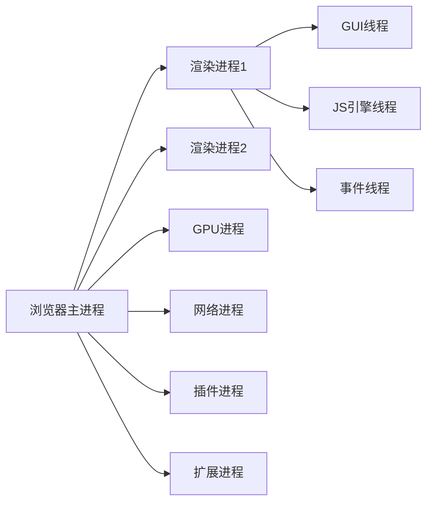
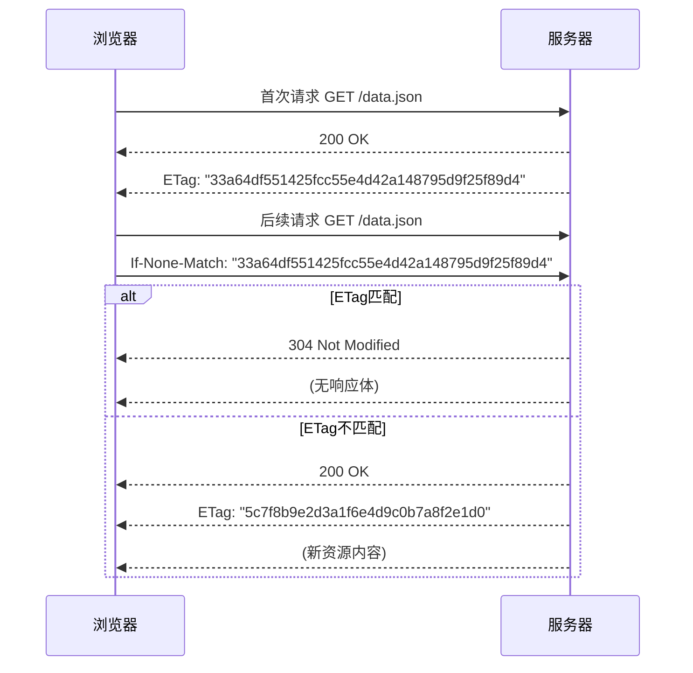
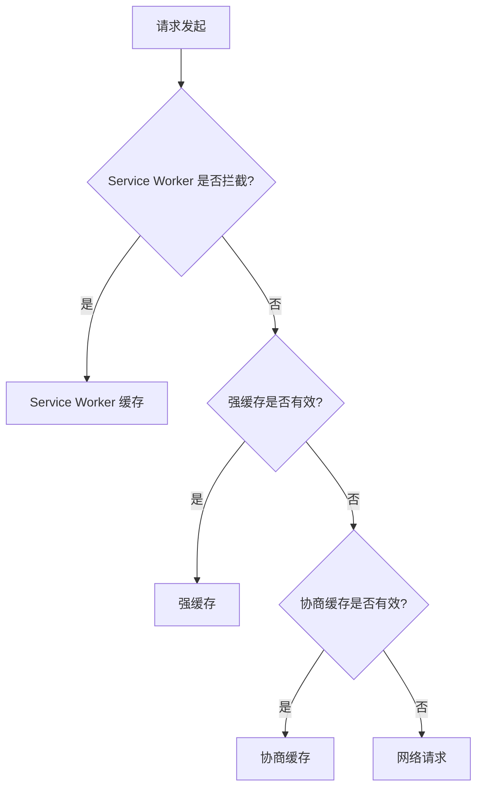

## 浏览器
### URL & URI & URN
- url（统一资源定位符 Uniform Resource Locator）
- uri（统一资源标志符 Uniform Resource Identifier）
- urn（统一资源名称 Uniform Resource Name）
url
### cookie & localStorage & sessionStorage
- cookie
	数据大小不能超过4k；
	设置过期时间之前一直有效；若没有设置过期时间，浏览器关闭数据丢失；
	数据会自动传递到服务器；
- localstorage
	数据5M；
	localStorage会永久存储，浏览器关闭数据不丢失，需要主动删除数据；
- sessionstorage
	数据5M；
	数据在当前窗口关闭后自动删除

### 浏览器输入url全过程（页面渲染全过程）

- 输入URL

- 查找缓存
	- 浏览器先查看浏览器缓存-系统缓存-路由缓存中是否有该页面地址（缓存DNS）；
	
- DNS域名解析
	- 浏览向DNS服务器发起请求，解析域名对应的IP地址；（DNS服务器基于UDP）；
	
- 建立TCP连接
	- （三次握手）
	
- 发起HTTP请求
	- 请求报文作为TCP三次握手的第三次数据发送给服务器；
	
- 服务器响应请求并返回结果（html文件，和对应的资源文件）

- 关闭TCP连接
	- （四次挥手）
	
- 浏览器渲染（解析html内容并渲染）
	- 解析HTML，构建成DOM树
	- 解析CSS，构建CSS规则树
	- 构建render树：浏览器将DOM树和CSSOM结合，构建出渲染树（render tree）
	- 布局Layout：计算每个节点在屏幕中的位置
	- 绘制Painting：遍历render树，使用UI后端层绘制每个节点
	

	```mermaid
	graph LR
	  A[HTML解析] --> B[DOM树]
	  C[CSS解析] --> D[CSSOM]
	  B & D --> E[渲染树]
	  E --> F[布局计算]
	  F --> G[分层]
	  G --> H[绘制指令]
	  H --> I[合成线程]
	  I --> J[分块Tile]
	  J --> K[GPU栅格化]
	  K --> L[显示页面]
	```
	
- 处理JS交互 & 事件监听
  
  - js加载和执行，绑定事件监听
  - 页面动态更新（DOM操作，异步操作等）
  
- 触发异步请求（ajax，fetch）

- 浏览器缓存 & 断开连接
  - 浏览器缓存静态资源（css，js，图片等），加快下次访问速度
  - TCP四次挥手，关闭连接，释放资源

### 浏览器整体架构与进程模型

浏览器采用**多进程架构**，主要进程包括：

1. **浏览器主进程（Browser Process）**
   - **唯一性**：整个浏览器仅有一个
   - **职责**：
     - 管理用户界面（地址栏、书签、前进/后退按钮）
     - 创建/销毁其他进程（如渲染进程、GPU进程）
     - 协调进程间通信（通过IPC机制）
     - 处理下载、权限管理、系统级事件
   - **重要性**：崩溃将导致整个浏览器关闭
2. **渲染进程（Renderer Process）**
   - **数量**：通常每个标签页独立一个（同源标签可能合并）
   - **职责**：
     - 解析HTML/CSS → 构建DOM树、CSSOM树
     - 执行JavaScript（通过JS引擎线程，如V8）
     - 处理页面布局（Layout）、绘制（Paint）
     - 管理事件循环（Event Loop）
   - **线程构成**：
     - **GUI渲染线程**：解析渲染页面（与JS引擎互斥）
     - **JS引擎线程**：执行JavaScript代码（单线程）
     - **事件触发线程**：管理任务队列（如点击、AJAX回调）
     - **定时器线程**：处理`setTimeout`/`setInterval`
     - **异步HTTP线程**：处理网络请求
3. **GPU进程（GPU Process）**
   - **唯一性**：通常全局仅一个
   - **职责**：
     - 加速图形渲染（CSS动画、WebGL、视频解码）
     - 管理GPU资源，减轻CPU负担
   - **协作方式**：合成线程将图层分块后交由GPU进程栅格化
4. **网络进程（Network Process）**
   - **职责**：
     - 处理所有网络请求（DNS解析、HTTP/HTTPS通信）
     - 管理缓存、Cookie、安全策略（如HSTS）
   - **优势**：独立进程避免网络阻塞影响页面渲染

> 💡 进程间通信通过**Mojo框架**或**IPC模块**实现，确保安全隔离



### DNS

- DNS解析流程

  - 浏览器缓存检查
    - 浏览器会先检查 【本地缓存】是否已存储该域名的IP地址，若有，则直接使用
  - 操作系统缓存检查
    - 若浏览器无缓存，则检查【操作系统（如Windows 的hosts文件）】，是否已经解析过该域名
  - 递归查询DNS缓存
    - 若本地无缓存，则系统向【本地DNS服务器（ISP提供）】请求解析
    - 若本地DNS服务器也找不到，向【跟DNS服务器】递归查询，依次向【顶级域名服务器（TLD，如*.com）、权威DNS服务器】继续查询，直到找到IP地址
  - 返回IP地址，访问网址
    - 获取IP地址后，DNS服务器将结果返回给浏览器，浏览器再向该IP发送请求，最终加载网页

- DNS解析优化

  - DNS预解析（DNS Prefetch）

    ```js
    <link rel="dns-prefetch" href="//cdn.example.com" >
    ```

  - CDN加速

  - 减少DNS查询次数（合并域名，避免多次查询）

### 缓存

| **缓存类型** | **工作原理**                                   | **通信机制**                        | **存储位置**        | **更新时机**             |
| :----------- | :--------------------------------------------- | :---------------------------------- | :------------------ | :----------------------- |
| **强缓存**   | 浏览器直接使用本地缓存资源，不发送请求到服务器 | 无网络请求                          | 内存缓存/磁盘缓存   | 缓存过期时间到达         |
| **协商缓存** | 浏览器发送请求到服务器验证资源是否更新         | 每次发送请求，服务器返回304或新资源 | 内存缓存/磁盘缓存   | 资源内容发生变化         |
| **离线缓存** | Service Worker拦截请求并返回自定义缓存         | Service Worker控制                  | Cache API/IndexedDB | 开发者主动更新或策略触发 |

#### 强缓存

- ##### Expires（格式：Expires: \<HTTP-date>）

  - HTTP/1.0标准，绝对时间（如`Expires: Wed, 21 Oct 2025 07:28:00 GMT`）（资源失效的时间）

  ```mermaid
  sequenceDiagram
      participant Client as 浏览器
      participant Server as 服务器
      
      Client->>Server: 请求资源
      Server-->>Client: 响应资源 + Expires 头
      Note over Client: 缓存资源并记录过期时间
      
      Client->>Server: 再次请求相同资源
      alt 当前时间 < Expires 时间
          Client-->>Client: 直接使用缓存（不发送请求）
      else 当前时间 >= Expires 时间
          Client->>Server: 发送完整请求
      end
  ```

- ##### Cache-Control（格式：Cache-Control: \<directive>）

  ## Cache-Control 详解

  ### 核心指令解析

  | **指令** | **值** | **说明**                                                     | **示例**               |
  | :------- | :----- | :----------------------------------------------------------- | :--------------------- |
  | max-age  | 秒数   | 资源有效期（从请求开始计算）                                 | `max-age=3600` (1小时) |
  | public   | -      | 允许任何缓存存储响应                                         | `public`               |
  | private  | -      | 仅允许客户端缓存响应                                         | `private`              |
  | no-store | -      | 禁止任何缓存                                                 | `no-store`             |
  | no-cache | -      | 可缓存但必须验证（使用`If-Modified-Since`或`If-None-Match`头部验证） | `no-cache`             |

  - HTTP/1.1标准，优先级更高（如`max-age=31536000`）（资源的有效期是 31536000 秒）

    ```mermaid
    sequenceDiagram
        participant Client as 浏览器
        participant Server as 服务器
        
        Client->>Server: 首次请求资源
        Server-->>Client: 响应 + Cache-Control: max-age=3600
        
        Note over Client: 计算缓存过期时间 = 当前时间 + 3600秒
        
        Client->>Server: 在3600秒内再次请求
        alt 缓存有效
            Client-->>Client: 直接使用缓存
        else 缓存过期
            Client->>Server: 发送新请求
            alt 资源未修改
                Server-->>Client: 304 Not Modified
                Client-->>Client: 更新缓存时间
            else 资源已修改
                Server-->>Client: 200 OK + 新内容
            end
        end
    ```

```bash
HTTP/1.1 200 OK
Cache-Control: public, max-age=31536000
Expires: Wed, 21 Oct 2025 07:28:00 GMT
```

#### 协商缓存

第一次请求响应头带上Last-Modified 或Etag；后续请求带上对应的If-Modified-Since或If-None-Match；若第一次没有，第二次也没有

最终由服务器决定是否使用缓存，即客户端与服务端之间存在一次通信；由服务器来确定缓存资源是否可用。

- ##### Last-Modified + If-Modified-Since（基于修改时间）

  - **响应头：Last-Modified**

    - Last-Modified: Tue, 15 Nov 2022 12:45:26 GMT（服务器上资源的最后修改时间）

  - **请求头：If-Modified-Since**

    - If-Modified-Since: Tue, 15 Nov 2022 12:45:26 GMT（浏览器将上次收到的Last-Modified的值发送给服务器）

  - ##### 适用场景

    - 静态文件（图片、CSS、JS）
    - 修改频率较低的资源
    - 不需要精确到毫秒级的缓存验证

  - ##### 局限性

    - 时间精度只有1秒
    - 文件修改时间变化但内容未变时失效
    - 服务器时间不同步导致问题

    ```mermaid
    sequenceDiagram
        participant Client as 浏览器
        participant Server as 服务器
        
        Client->>Server: 首次请求 GET /resource.jpg
        Server-->>Client: 200 OK
        Server-->>Client: Last-Modified: Wed, 21 Oct 2020 07:28:00 GMT
        
        Client->>Server: 后续请求 GET /resource.jpg
        Client->>Server: If-Modified-Since: Wed, 21 Oct 2020 07:28:00 GMT
        
        alt 资源未修改
            Server-->>Client: 304 Not Modified
            Server-->>Client: (无响应体)
        else 资源已修改
            Server-->>Client: 200 OK
            Server-->>Client: Last-Modified: Thu, 22 Oct 2020 09:15:00 GMT
            Server-->>Client: (新资源内容)
        end
    ```

- ##### ETag + If-None-Match （基于内存哈希（更可靠））

  - ##### ETag（格式：ETag: [weak/]<etag_value>）

    - 强ETag: `ETag: "686897696a7c876b7e"` / 弱ETag: `ETag: W/"686897696a7c876b7e"`
    - 服务器生成的资源唯一标识符（通常是内容哈希值）
    - **强验证**：要求字节完全一致
    - **弱验证**：语义相同即可（如只改变空格）

  - ##### If-None-Match（格式：If-None-Match: <etag_value> | *）

    - 单个ETag: `If-None-Match: "686897696a7c876b7e"`
    - 多个ETag: `If-None-Match: "etag1", "etag2", W/"weak-etag"`
    - 任意ETag: `If-None-Match: *`
    - 浏览器将上次收到的ETag值发送给服务器
    - `*` 表示匹配任意ETag（用于检查资源是否存在）



#### 优先级

| **缓存类型**        | **优先级** | **触发条件**                        | **存储位置** | **更新机制**   |
| :------------------ | :--------- | :---------------------------------- | :----------- | :------------- |
| Service Worker 缓存 | 最高       | 请求被 Service Worker 拦截          | Cache API    | 开发者主动更新 |
| 内存缓存            | 高         | 会话期内高频访问资源                | RAM          | 页面关闭即清除 |
| 强缓存              | 中高       | Cache-Control/Expires 有效          | 磁盘         | 过期时间到达   |
| 协商缓存            | 中低       | 强缓存失效，ETag/Last-Modified 有效 | 磁盘         | 资源内容变化   |
| 网络请求            | 最低       | 所有缓存均未命中                    | -            | 每次请求       |



### 跨域

- 为什么
	同源策略：域名、协议、端口号相同。
- 如何解决
    Jsonp实现原理：动态创建script标签，src指向服务端接口地址，回调函数放在callback参数后，服务端把数据拼接到callback后返回，执行回调；只支持get请求
    其他方法：
    后端配置CORS : Access-Control-Allow-Origin
    Nodejs转发
    Nginx代理
    Document.domain + inframe
- WebSocket 不受同源策略限制，可以跨域通信
- 为什么本地可以解决跨域问题
### prefetch & preload 【Resource-Hints（资源提示）】

- perfetch（链接预取）（预提取）
	prefetch是一种浏览器机制；
	利用浏览器空闲时间来下载或预取用户在不久将来可能访问的文档；
	网页向浏览器提供一组预取提示，在浏览器完成当前页面加载后，静默拉取指定文档，存在缓存中；
	<link rel="prefetch" href="static/img/ticket_bg.a5bb7c33.png">
- preload（预加载）
	通过标签显式声明一个高优先级的资源，强制浏览器提前请求资源；同时不阻塞文档正常加载；
	

